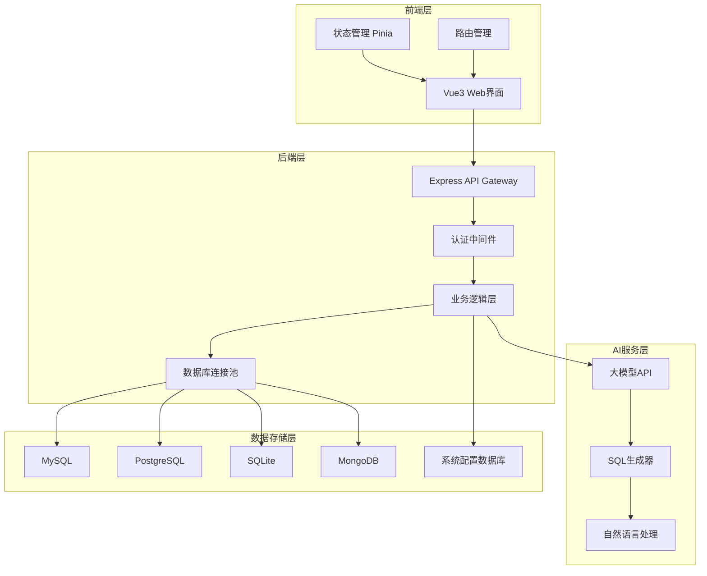
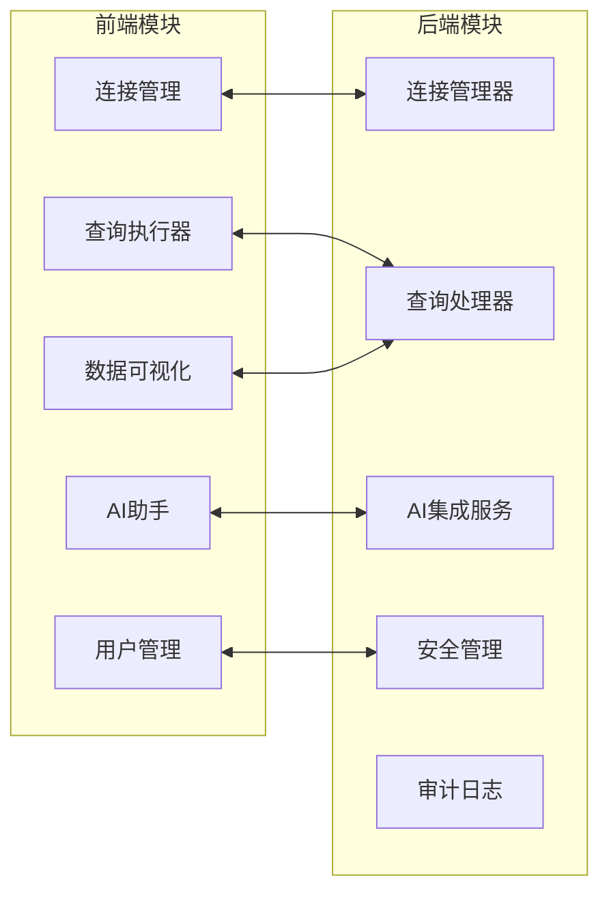
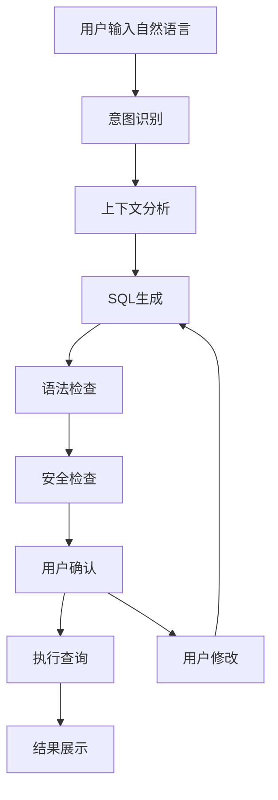
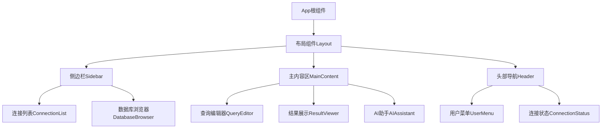
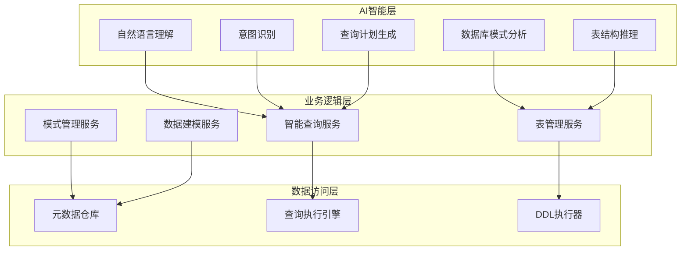
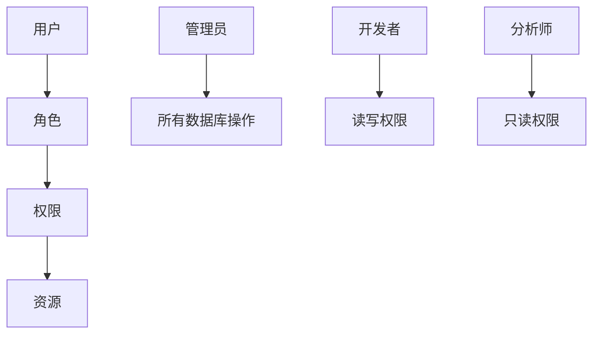
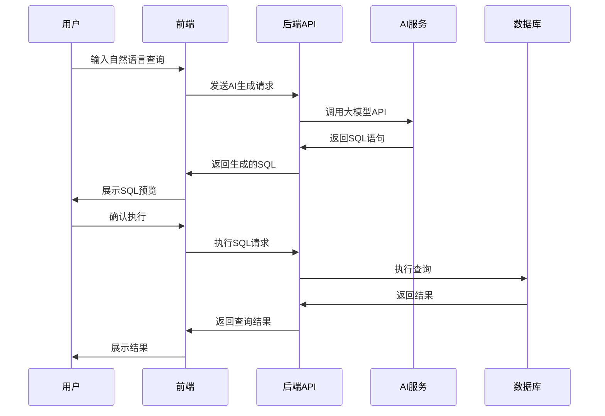
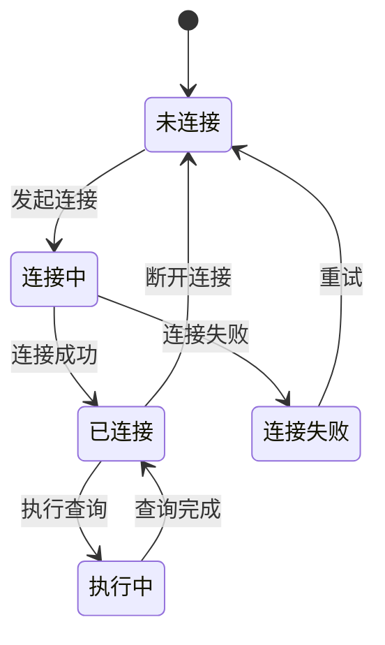

# AI数据库管理系统设计文档

## 1. 项目概览

### 1.1 系统目标
设计一个通用的由大模型驱动的数据库管理系统，支持多类型数据库操作，通过自然语言交互简化数据库管理流程。

### 1.2 核心价值
- **智能化操作**: 用户可以通过自然语言描述需求，AI自动生成SQL语句
- **多数据库支持**: 统一界面管理不同类型的数据库
- **安全性**: 提供权限控制和操作审计
- **易用性**: 直观的Web界面，降低数据库操作门槛

### 1.3 技术栈

#### 前端技术栈
- **框架**: Vue 3 (Composition API)
- **构建工具**: Vite
- **样式**: TailwindCSS v4
- **状态管理**: Pinia
- **路由**: Vue Router
- **HTTP客户端**: Axios
- **组件库**: Element Plus / Ant Design Vue

#### 后端技术栈
- **运行时**: Node.js
- **框架**: Express.js
- **语言**: TypeScript
- **数据库ORM**: Prisma / TypeORM
- **认证**: JWT
- **文档**: Swagger
- **日志**: Winston

## 2. 系统架构

### 2.1 整体架构图



### 2.2 模块架构



## 3. 核心功能需求

### 3.1 数据库连接管理

#### 3.1.1 支持的数据库类型
- **关系型数据库**: MySQL, PostgreSQL, SQLite, SQL Server, Oracle
- **NoSQL数据库**: MongoDB, Redis
- **云数据库**: AWS RDS, Azure SQL, Google Cloud SQL
- **时序数据库**: InfluxDB, TimescaleDB

#### 3.1.2 连接配置
```typescript
interface DatabaseConnection {
  id: string;
  name: string;
  type: DatabaseType;
  host: string;
  port: number;
  database: string;
  username: string;
  password: string;
  ssl?: boolean;
  connectionString?: string;
  metadata?: {
    description: string;
    tags: string[];
    environment: 'development' | 'staging' | 'production';
  };
}
```

### 3.2 AI驱动的查询功能

#### 3.2.1 自然语言查询
- 用户输入自然语言描述
- AI解析用户意图
- 生成对应的SQL语句
- 执行前预览和确认

#### 3.2.2 查询优化建议
- 性能分析
- 索引建议
- 查询重写建议

#### 3.2.3 AI功能流程


### 3.3 数据库操作功能

#### 3.3.1 表管理
- 表结构查看
- 创建/修改/删除表
- 索引管理
- 约束管理

#### 3.3.2 数据操作
- 数据查询和筛选
- 数据插入/更新/删除
- 批量导入/导出
- 数据备份和恢复

#### 3.3.3 数据可视化
- 查询结果表格展示
- 图表生成（柱状图、折线图、饼图）
- 数据关系图
- 实时数据监控

## 4. 前端架构设计

### 4.1 组件层次结构



### 4.2 状态管理

```typescript
// Pinia Store结构
interface AppState {
  user: UserState;
  connections: ConnectionState;
  queries: QueryState;
  ai: AIState;
}

interface ConnectionState {
  activeConnection: DatabaseConnection | null;
  connectionList: DatabaseConnection[];
  connectionStatus: Map<string, boolean>;
}

interface QueryState {
  currentQuery: string;
  queryHistory: QueryRecord[];
  queryResults: QueryResult[];
  isLoading: boolean;
}

interface AIState {
  isProcessing: boolean;
  conversation: AIMessage[];
  suggestions: string[];
}
```

### 4.3 路由设计

```typescript
const routes = [
  {
    path: '/',
    component: Layout,
    children: [
      { path: '', redirect: '/dashboard' },
      { path: 'dashboard', component: Dashboard },
      { path: 'connections', component: ConnectionManager },
      { path: 'query/:connectionId?', component: QueryWorkspace },
      { path: 'ai-assistant', component: AIAssistant },
      { path: 'settings', component: Settings }
    ]
  },
  { path: '/login', component: Login },
  { path: '/register', component: Register }
];
```

### 4.4 AI助手组件设计

#### 4.4.1 智能查询组件

```typescript
// 智能查询组件
const IntelligentQueryPanel = defineComponent({
  setup() {
    const aiStore = useAIStore();
    const queryStore = useQueryStore();
    
    const naturalQuery = ref('');
    const isAnalyzing = ref(false);
    const queryResult = ref<IntelligentQueryResult | null>(null);
    
    const analyzeQuery = async () => {
      if (!naturalQuery.value.trim()) return;
      
      isAnalyzing.value = true;
      try {
        queryResult.value = await aiStore.processNaturalQuery(
          queryStore.activeConnectionId,
          naturalQuery.value
        );
      } finally {
        isAnalyzing.value = false;
      }
    };
    
    const executeQuery = async () => {
      if (!queryResult.value) return;
      
      await queryStore.executeQuery(
        queryResult.value.query.sql,
        queryResult.value.query.optimizedSQL
      );
    };
    
    return {
      naturalQuery,
      isAnalyzing,
      queryResult,
      analyzeQuery,
      executeQuery
    };
  }
});
```

#### 4.4.2 表管理组件

```typescript
// 智能表管理组件
const IntelligentTableManager = defineComponent({
  setup() {
    const tableStore = useTableStore();
    const aiStore = useAIStore();
    
    const tableOperation = ref('');
    const isProcessing = ref(false);
    const managementResult = ref<TableManagementResult | null>(null);
    
    const processTableOperation = async () => {
      if (!tableOperation.value.trim()) return;
      
      isProcessing.value = true;
      try {
        managementResult.value = await aiStore.processTableManagement(
          tableStore.activeConnectionId,
          tableOperation.value
        );
      } finally {
        isProcessing.value = false;
      }
    };
    
    const executeTableOperation = async () => {
      if (!managementResult.value) return;
      
      if (managementResult.value.type === 'create') {
        await tableStore.createTable(managementResult.value.sql);
      } else if (managementResult.value.type === 'alter') {
        await tableStore.alterTable(managementResult.value.modifications);
      }
    };
    
    return {
      tableOperation,
      isProcessing,
      managementResult,
      processTableOperation,
      executeTableOperation
    };
  }
});
```

#### 4.4.3 JSON Schema展示组件

```typescript
// JSON Schema展示组件
const JSONSchemaViewer = defineComponent({
  props: {
    schema: {
      type: Object as PropType<JSONSchema>,
      required: true
    },
    data: {
      type: Array as PropType<Record<string, any>[]>,
      default: () => []
    }
  },
  
  setup(props) {
    const formatSchema = (schema: JSONSchema) => {
      return JSON.stringify(schema, null, 2);
    };
    
    const validateData = (item: Record<string, any>) => {
      // 使用JSON Schema验证数据
      return validateAgainstSchema(item, props.schema);
    };
    
    const exportSchema = () => {
      const blob = new Blob([formatSchema(props.schema)], {
        type: 'application/json'
      });
      const url = URL.createObjectURL(blob);
      const link = document.createElement('a');
      link.href = url;
      link.download = 'schema.json';
      link.click();
    };
    
    return {
      formatSchema,
      validateData,
      exportSchema
    };
  }
});
```

## 5. 统一数据库接口设计

### 5.1 接口抽象层

#### 5.1.1 核心接口定义

```typescript
// 统一数据库操作接口
interface DatabaseAdapter {
  // 连接管理
  connect(config: DatabaseConnection): Promise<void>;
  disconnect(): Promise<void>;
  testConnection(): Promise<boolean>;
  
  // 查询操作
  executeQuery(sql: string, params?: any[]): Promise<QueryResult>;
  executeTransaction(queries: TransactionQuery[]): Promise<QueryResult[]>;
  
  // 结构查询
  getDatabases(): Promise<DatabaseInfo[]>;
  getTables(database?: string): Promise<TableInfo[]>;
  getTableSchema(tableName: string): Promise<ColumnInfo[]>;
  getIndexes(tableName: string): Promise<IndexInfo[]>;
  
  // 数据操作
  insert(tableName: string, data: Record<string, any>): Promise<InsertResult>;
  update(tableName: string, data: Record<string, any>, where: WhereClause): Promise<UpdateResult>;
  delete(tableName: string, where: WhereClause): Promise<DeleteResult>;
  
  // 性能分析
  explainQuery(sql: string): Promise<ExplainResult>;
  getQueryStats(): Promise<QueryStats>;
}

// 通用数据类型
interface QueryResult {
  rows: Record<string, any>[];
  rowCount: number;
  fields: FieldInfo[];
  executionTime: number;
  affectedRows?: number;
}

interface TableInfo {
  name: string;
  type: 'table' | 'view' | 'collection';
  rowCount?: number;
  size?: string;
  engine?: string;
  collation?: string;
  comment?: string;
}

interface ColumnInfo {
  name: string;
  type: string;
  nullable: boolean;
  defaultValue?: any;
  isPrimaryKey: boolean;
  isAutoIncrement: boolean;
  maxLength?: number;
  precision?: number;
  scale?: number;
  comment?: string;
}
```

#### 5.1.2 SQL方言抽象

```typescript
// SQL方言转换接口
interface SQLDialect {
  // 数据类型映射
  mapDataType(genericType: string): string;
  
  // 语法转换
  limitClause(limit: number, offset?: number): string;
  dateFormat(format: string): string;
  quoteIdentifier(identifier: string): string;
  
  // 特殊函数映射
  concat(...columns: string[]): string;
  substring(column: string, start: number, length?: number): string;
  currentTimestamp(): string;
}

// MySQL方言实现
class MySQLDialect implements SQLDialect {
  mapDataType(genericType: string): string {
    const typeMap = {
      'string': 'VARCHAR',
      'text': 'TEXT',
      'integer': 'INT',
      'bigint': 'BIGINT',
      'decimal': 'DECIMAL',
      'boolean': 'BOOLEAN',
      'date': 'DATE',
      'datetime': 'DATETIME',
      'timestamp': 'TIMESTAMP'
    };
    return typeMap[genericType] || genericType;
  }
  
  limitClause(limit: number, offset?: number): string {
    return offset ? `LIMIT ${offset}, ${limit}` : `LIMIT ${limit}`;
  }
  
  quoteIdentifier(identifier: string): string {
    return `\`${identifier}\``;
  }
  
  concat(...columns: string[]): string {
    return `CONCAT(${columns.join(', ')})`;
  }
  
  currentTimestamp(): string {
    return 'NOW()';
  }
}

// PostgreSQL方言实现
class PostgreSQLDialect implements SQLDialect {
  mapDataType(genericType: string): string {
    const typeMap = {
      'string': 'VARCHAR',
      'text': 'TEXT',
      'integer': 'INTEGER',
      'bigint': 'BIGINT',
      'decimal': 'NUMERIC',
      'boolean': 'BOOLEAN',
      'date': 'DATE',
      'datetime': 'TIMESTAMP',
      'timestamp': 'TIMESTAMP WITH TIME ZONE'
    };
    return typeMap[genericType] || genericType;
  }
  
  limitClause(limit: number, offset?: number): string {
    return offset ? `LIMIT ${limit} OFFSET ${offset}` : `LIMIT ${limit}`;
  }
  
  quoteIdentifier(identifier: string): string {
    return `"${identifier}"`;
  }
  
  concat(...columns: string[]): string {
    return `${columns.join(' || ')}`;
  }
  
  currentTimestamp(): string {
    return 'CURRENT_TIMESTAMP';
  }
}
```

### 5.2 适配器模式实现

#### 5.2.1 关系型数据库适配器

```typescript
// MySQL适配器
class MySQLAdapter implements DatabaseAdapter {
  private connection: mysql.Connection;
  private dialect: MySQLDialect;
  
  constructor(private config: DatabaseConnection) {
    this.dialect = new MySQLDialect();
  }
  
  async connect(): Promise<void> {
    this.connection = await mysql.createConnection({
      host: this.config.host,
      port: this.config.port,
      user: this.config.username,
      password: this.config.password,
      database: this.config.database,
      ssl: this.config.ssl
    });
  }
  
  async executeQuery(sql: string, params?: any[]): Promise<QueryResult> {
    const startTime = Date.now();
    const [rows, fields] = await this.connection.execute(sql, params);
    const executionTime = Date.now() - startTime;
    
    return {
      rows: rows as Record<string, any>[],
      rowCount: (rows as any[]).length,
      fields: this.mapFields(fields),
      executionTime
    };
  }
  
  async getTables(): Promise<TableInfo[]> {
    const sql = `
      SELECT 
        TABLE_NAME as name,
        TABLE_TYPE as type,
        TABLE_ROWS as rowCount,
        ROUND(((DATA_LENGTH + INDEX_LENGTH) / 1024 / 1024), 2) as size,
        ENGINE as engine,
        TABLE_COLLATION as collation,
        TABLE_COMMENT as comment
      FROM information_schema.TABLES 
      WHERE TABLE_SCHEMA = ?
    `;
    
    const result = await this.executeQuery(sql, [this.config.database]);
    return result.rows.map(row => ({
      name: row.name,
      type: row.type === 'BASE TABLE' ? 'table' : 'view',
      rowCount: row.rowCount,
      size: `${row.size}MB`,
      engine: row.engine,
      collation: row.collation,
      comment: row.comment
    }));
  }
  
  async getTableSchema(tableName: string): Promise<ColumnInfo[]> {
    const sql = `
      SELECT 
        COLUMN_NAME as name,
        DATA_TYPE as type,
        IS_NULLABLE as nullable,
        COLUMN_DEFAULT as defaultValue,
        COLUMN_KEY as key,
        EXTRA as extra,
        CHARACTER_MAXIMUM_LENGTH as maxLength,
        NUMERIC_PRECISION as precision,
        NUMERIC_SCALE as scale,
        COLUMN_COMMENT as comment
      FROM information_schema.COLUMNS 
      WHERE TABLE_SCHEMA = ? AND TABLE_NAME = ?
      ORDER BY ORDINAL_POSITION
    `;
    
    const result = await this.executeQuery(sql, [this.config.database, tableName]);
    return result.rows.map(row => ({
      name: row.name,
      type: row.type,
      nullable: row.nullable === 'YES',
      defaultValue: row.defaultValue,
      isPrimaryKey: row.key === 'PRI',
      isAutoIncrement: row.extra.includes('auto_increment'),
      maxLength: row.maxLength,
      precision: row.precision,
      scale: row.scale,
      comment: row.comment
    }));
  }
  
  private mapFields(fields: any[]): FieldInfo[] {
    return fields.map(field => ({
      name: field.name,
      type: field.type,
      length: field.length
    }));
  }
}

// PostgreSQL适配器
class PostgreSQLAdapter implements DatabaseAdapter {
  private client: pg.Client;
  private dialect: PostgreSQLDialect;
  
  constructor(private config: DatabaseConnection) {
    this.dialect = new PostgreSQLDialect();
  }
  
  async connect(): Promise<void> {
    this.client = new pg.Client({
      host: this.config.host,
      port: this.config.port,
      user: this.config.username,
      password: this.config.password,
      database: this.config.database,
      ssl: this.config.ssl
    });
    await this.client.connect();
  }
  
  async executeQuery(sql: string, params?: any[]): Promise<QueryResult> {
    const startTime = Date.now();
    const result = await this.client.query(sql, params);
    const executionTime = Date.now() - startTime;
    
    return {
      rows: result.rows,
      rowCount: result.rowCount,
      fields: result.fields.map(field => ({
        name: field.name,
        type: field.dataTypeID.toString(),
        length: field.dataTypeModifier
      })),
      executionTime
    };
  }
  
  async getTables(): Promise<TableInfo[]> {
    const sql = `
      SELECT 
        tablename as name,
        'table' as type,
        schemaname
      FROM pg_tables 
      WHERE schemaname = 'public'
      UNION ALL
      SELECT 
        viewname as name,
        'view' as type,
        schemaname
      FROM pg_views 
      WHERE schemaname = 'public'
    `;
    
    const result = await this.executeQuery(sql);
    return result.rows.map(row => ({
      name: row.name,
      type: row.type as 'table' | 'view'
    }));
  }
  
  async getTableSchema(tableName: string): Promise<ColumnInfo[]> {
    const sql = `
      SELECT 
        column_name as name,
        data_type as type,
        is_nullable as nullable,
        column_default as defaultValue,
        character_maximum_length as maxLength,
        numeric_precision as precision,
        numeric_scale as scale
      FROM information_schema.columns 
      WHERE table_name = $1
      ORDER BY ordinal_position
    `;
    
    const result = await this.executeQuery(sql, [tableName]);
    return result.rows.map(row => ({
      name: row.name,
      type: row.type,
      nullable: row.nullable === 'YES',
      defaultValue: row.defaultValue,
      isPrimaryKey: false, // 需要额外查询
      isAutoIncrement: row.defaultValue?.includes('nextval'),
      maxLength: row.maxLength,
      precision: row.precision,
      scale: row.scale
    }));
  }
}
```

#### 5.2.2 NoSQL数据库适配器

```typescript
// MongoDB适配器
class MongoDBAdapter implements DatabaseAdapter {
  private client: MongoClient;
  private db: Db;
  
  constructor(private config: DatabaseConnection) {}
  
  async connect(): Promise<void> {
    this.client = new MongoClient(this.config.connectionString!);
    await this.client.connect();
    this.db = this.client.db(this.config.database);
  }
  
  async executeQuery(query: string, params?: any[]): Promise<QueryResult> {
    // MongoDB查询转换逻辑
    const mongoQuery = this.parseMongoQuery(query);
    const startTime = Date.now();
    
    let result;
    switch (mongoQuery.operation) {
      case 'find':
        result = await this.db.collection(mongoQuery.collection)
          .find(mongoQuery.filter)
          .limit(mongoQuery.limit || 0)
          .skip(mongoQuery.skip || 0)
          .toArray();
        break;
      case 'aggregate':
        result = await this.db.collection(mongoQuery.collection)
          .aggregate(mongoQuery.pipeline)
          .toArray();
        break;
    }
    
    const executionTime = Date.now() - startTime;
    
    return {
      rows: result.map(doc => ({ ...doc, _id: doc._id.toString() })),
      rowCount: result.length,
      fields: this.extractFields(result),
      executionTime
    };
  }
  
  async getTables(): Promise<TableInfo[]> {
    const collections = await this.db.listCollections().toArray();
    return collections.map(col => ({
      name: col.name,
      type: 'collection' as const
    }));
  }
  
  async getTableSchema(collectionName: string): Promise<ColumnInfo[]> {
    // 分析集合中的文档结构
    const sample = await this.db.collection(collectionName)
      .aggregate([
        { $sample: { size: 100 } },
        { $project: { schema: { $objectToArray: '$$ROOT' } } },
        { $unwind: '$schema' },
        { $group: {
          _id: '$schema.k',
          types: { $addToSet: { $type: '$schema.v' } },
          count: { $sum: 1 }
        }}
      ])
      .toArray();
    
    return sample.map(field => ({
      name: field._id,
      type: field.types.join(' | '),
      nullable: field.count < 100, // 如果不是所有文档都有这个字段
      isPrimaryKey: field._id === '_id',
      isAutoIncrement: false
    }));
  }
  
  private parseMongoQuery(query: string): any {
    // 简化的MongoDB查询解析逻辑
    // 实际实现需要更复杂的解析器
    if (query.startsWith('db.')) {
      // 解析MongoDB shell语法
      return this.parseShellSyntax(query);
    } else {
      // 尝试解析SQL到MongoDB的转换
      return this.sqlToMongo(query);
    }
  }
  
  private extractFields(docs: any[]): FieldInfo[] {
    if (docs.length === 0) return [];
    
    const fields = new Set<string>();
    docs.forEach(doc => {
      Object.keys(doc).forEach(key => fields.add(key));
    });
    
    return Array.from(fields).map(name => ({
      name,
      type: 'mixed',
      length: 0
    }));
  }
}
```

### 5.3 适配器工厂

```typescript
// 适配器工厂
class DatabaseAdapterFactory {
  static create(config: DatabaseConnection): DatabaseAdapter {
    switch (config.type) {
      case 'mysql':
        return new MySQLAdapter(config);
      case 'postgresql':
        return new PostgreSQLAdapter(config);
      case 'sqlite':
        return new SQLiteAdapter(config);
      case 'mongodb':
        return new MongoDBAdapter(config);
      case 'redis':
        return new RedisAdapter(config);
      case 'mssql':
        return new MSSQLAdapter(config);
      case 'oracle':
        return new OracleAdapter(config);
      default:
        throw new Error(`Unsupported database type: ${config.type}`);
    }
  }
  
  static getSupportedTypes(): string[] {
    return [
      'mysql',
      'postgresql', 
      'sqlite',
      'mongodb',
      'redis',
      'mssql',
      'oracle'
    ];
  }
}

// 数据库管理器
class DatabaseManager {
  private adapters: Map<string, DatabaseAdapter> = new Map();
  
  async getAdapter(connectionId: string): Promise<DatabaseAdapter> {
    if (!this.adapters.has(connectionId)) {
      const config = await this.getConnectionConfig(connectionId);
      const adapter = DatabaseAdapterFactory.create(config);
      await adapter.connect();
      this.adapters.set(connectionId, adapter);
    }
    
    return this.adapters.get(connectionId)!;
  }
  
  async executeQuery(connectionId: string, query: string, params?: any[]): Promise<QueryResult> {
    const adapter = await this.getAdapter(connectionId);
    return adapter.executeQuery(query, params);
  }
  
  async getSchema(connectionId: string): Promise<DatabaseSchema> {
    const adapter = await this.getAdapter(connectionId);
    const tables = await adapter.getTables();
    
    const schema: DatabaseSchema = {
      tables: []
    };
    
    for (const table of tables) {
      const columns = await adapter.getTableSchema(table.name);
      schema.tables.push({
        name: table.name,
        type: table.type,
        columns,
        indexes: await adapter.getIndexes(table.name)
      });
    }
    
    return schema;
  }
  
  private async getConnectionConfig(connectionId: string): Promise<DatabaseConnection> {
    // 从数据库或配置中获取连接信息
    // 实现省略
    throw new Error('Not implemented');
  }
}
```

### 5.4 统一查询语言转换

```typescript
// 通用查询构建器
class UniversalQueryBuilder {
  private query: any = {};
  
  select(columns: string[]): this {
    this.query.select = columns;
    return this;
  }
  
  from(table: string): this {
    this.query.from = table;
    return this;
  }
  
  where(condition: WhereCondition): this {
    this.query.where = condition;
    return this;
  }
  
  limit(count: number): this {
    this.query.limit = count;
    return this;
  }
  
  offset(count: number): this {
    this.query.offset = count;
    return this;
  }
  
  // 转换为特定数据库的查询
  toSQL(dialect: SQLDialect): string {
    let sql = `SELECT ${this.query.select.join(', ')} FROM ${dialect.quoteIdentifier(this.query.from)}`;
    
    if (this.query.where) {
      sql += ` WHERE ${this.buildWhereClause(this.query.where, dialect)}`;
    }
    
    if (this.query.limit) {
      sql += ` ${dialect.limitClause(this.query.limit, this.query.offset)}`;
    }
    
    return sql;
  }
  
  toMongo(): any {
    const mongoQuery: any = {
      collection: this.query.from,
      operation: 'find',
      filter: this.buildMongoFilter(this.query.where)
    };
    
    if (this.query.limit) {
      mongoQuery.limit = this.query.limit;
    }
    
    if (this.query.offset) {
      mongoQuery.skip = this.query.offset;
    }
    
    return mongoQuery;
  }
  
  private buildWhereClause(condition: WhereCondition, dialect: SQLDialect): string {
    // 构建SQL WHERE子句
    // 实现省略
    return '';
  }
  
  private buildMongoFilter(condition: WhereCondition): any {
    // 构建MongoDB过滤器
    // 实现省略
    return {};
  }
}
```

## 6. 后端架构设计

### 6.1 API接口设计

#### 6.1.1 认证接口
```typescript
POST /api/auth/login
POST /api/auth/register
POST /api/auth/refresh
POST /api/auth/logout
```

#### 6.1.2 连接管理接口
```typescript
GET    /api/connections              // 获取连接列表
POST   /api/connections              // 创建新连接
PUT    /api/connections/:id          // 更新连接
DELETE /api/connections/:id          // 删除连接
POST   /api/connections/:id/test     // 测试连接
```

#### 6.1.3 查询执行接口
```typescript
POST   /api/query/execute            // 执行SQL查询
POST   /api/query/explain            // 查询执行计划
GET    /api/query/history            // 查询历史
POST   /api/query/ai-generate        // AI生成SQL
```

#### 6.1.4 数据库操作接口
```typescript
GET    /api/database/:id/schema      // 获取数据库结构
GET    /api/database/:id/tables      // 获取表列表
GET    /api/database/:id/table/:name // 获取表详情
POST   /api/database/:id/table       // 创建表
PUT    /api/database/:id/table/:name // 修改表
DELETE /api/database/:id/table/:name // 删除表
```

### 6.2 服务层架构

```typescript
// 服务层接口定义
interface ConnectionService {
  createConnection(config: DatabaseConnection): Promise<string>;
  testConnection(id: string): Promise<boolean>;
  getConnection(id: string): Promise<DatabaseConnection>;
  listConnections(userId: string): Promise<DatabaseConnection[]>;
}

interface QueryService {
  executeQuery(connectionId: string, sql: string): Promise<QueryResult>;
  getQueryHistory(userId: string): Promise<QueryRecord[]>;
  explainQuery(connectionId: string, sql: string): Promise<ExplainResult>;
}

interface AIService {
  generateSQL(prompt: string, schema: DatabaseSchema): Promise<string>;
  optimizeQuery(sql: string): Promise<OptimizationSuggestion[]>;
  explainQuery(sql: string): Promise<string>;
}
```

### 6.3 数据库连接池管理

```typescript
class ConnectionPoolManager {
  private pools: Map<string, Pool> = new Map();
  
  async getConnection(connectionId: string): Promise<Connection> {
    if (!this.pools.has(connectionId)) {
      const config = await this.getConnectionConfig(connectionId);
      this.pools.set(connectionId, this.createPool(config));
    }
    return this.pools.get(connectionId)!.getConnection();
  }
  
  private createPool(config: DatabaseConnection): Pool {
    // 根据数据库类型创建对应的连接池
  }
}
```

## 7. AI集成设计

### 7.1 智能数据库管理架构



### 7.2 智能查询分析服务

#### 7.2.1 自然语言查询理解

```typescript
// 查询意图分析接口
interface QueryIntentAnalyzer {
  analyzeIntent(naturalLanguage: string, schema: DatabaseSchema): Promise<QueryIntent>;
  generateQueryPlan(intent: QueryIntent): Promise<QueryPlan>;
  optimizeQuery(plan: QueryPlan): Promise<OptimizedQuery>;
}

// 查询意图结构
interface QueryIntent {
  type: 'SELECT' | 'INSERT' | 'UPDATE' | 'DELETE' | 'CREATE' | 'ALTER' | 'DROP';
  entities: string[]; // 涉及的实体/表
  attributes: string[]; // 需要的字段
  conditions: QueryCondition[]; // 查询条件
  relationships: TableRelationship[]; // 表关系
  aggregations?: AggregationFunction[]; // 聚合函数
  sorting?: SortingCriteria[]; // 排序条件
  pagination?: PaginationInfo; // 分页信息
}

// 查询条件
interface QueryCondition {
  field: string;
  operator: 'eq' | 'ne' | 'gt' | 'lt' | 'like' | 'in' | 'between';
  value: any;
  logicalOperator?: 'AND' | 'OR';
}

// 表关系
interface TableRelationship {
  fromTable: string;
  toTable: string;
  joinType: 'INNER' | 'LEFT' | 'RIGHT' | 'FULL';
  onCondition: string;
}
```

#### 7.2.2 智能查询服务实现

```typescript
class IntelligentQueryService implements QueryIntentAnalyzer {
  constructor(
    private aiProvider: AIProvider,
    private schemaService: SchemaService,
    private databaseManager: DatabaseManager
  ) {}
  
  async analyzeIntent(naturalLanguage: string, schema: DatabaseSchema): Promise<QueryIntent> {
    const prompt = this.buildQueryAnalysisPrompt(naturalLanguage, schema);
    
    const aiResponse = await this.aiProvider.complete({
      prompt,
      model: 'gpt-4',
      temperature: 0.1,
      responseFormat: 'json'
    });
    
    const intent = JSON.parse(aiResponse.content) as QueryIntent;
    return this.validateIntent(intent, schema);
  }
  
  async generateQueryPlan(intent: QueryIntent): Promise<QueryPlan> {
    // 分析需要查询的表
    const requiredTables = await this.identifyRequiredTables(intent);
    
    // 构建表关系
    const relationships = await this.buildTableRelationships(requiredTables);
    
    // 生成查询计划
    return {
      tables: requiredTables,
      joins: relationships,
      selectFields: intent.attributes,
      whereConditions: intent.conditions,
      orderBy: intent.sorting,
      limit: intent.pagination?.limit
    };
  }
  
  async optimizeQuery(plan: QueryPlan): Promise<OptimizedQuery> {
    const baseSQL = this.generateSQL(plan);
    
    const optimizationPrompt = `
      请优化以下SQL查询，提供性能改进建议：
      
      原始查询：
      ${baseSQL}
      
      数据库结构：
      ${JSON.stringify(plan.tables, null, 2)}
      
      请返回：
      1. 优化后的SQL
      2. 建议的索引
      3. 性能改进说明
    `;
    
    const aiResponse = await this.aiProvider.complete({
      prompt: optimizationPrompt,
      model: 'gpt-4'
    });
    
    return {
      sql: baseSQL,
      optimizedSQL: this.extractOptimizedSQL(aiResponse.content),
      indexSuggestions: this.extractIndexSuggestions(aiResponse.content),
      explanation: aiResponse.content
    };
  }
  
  private buildQueryAnalysisPrompt(naturalLanguage: string, schema: DatabaseSchema): string {
    return `
      作为数据库查询专家，请分析以下自然语言查询需求，并生成结构化的查询意图。
      
      用户查询："${naturalLanguage}"
      
      可用的数据库结构：
      ${this.formatSchemaForPrompt(schema)}
      
      请返回JSON格式的查询意图，包含：
      {
        "type": "查询类型(SELECT/INSERT/UPDATE/DELETE/CREATE/ALTER/DROP)",
        "entities": ["涉及的表名"],
        "attributes": ["需要查询的字段"],
        "conditions": [
          {
            "field": "字段名",
            "operator": "操作符",
            "value": "值",
            "logicalOperator": "AND/OR"
          }
        ],
        "relationships": [
          {
            "fromTable": "主表",
            "toTable": "关联表",
            "joinType": "JOIN类型",
            "onCondition": "关联条件"
          }
        ]
      }
      
      注意：
      1. 仔细分析用户意图，确定需要查询哪些表
      2. 根据表结构推断字段映射关系
      3. 识别表之间的关联关系
      4. 提取查询条件和过滤条件
    `;
  }
  
  private async identifyRequiredTables(intent: QueryIntent): Promise<TableInfo[]> {
    const tables: TableInfo[] = [];
    
    for (const entityName of intent.entities) {
      // 智能匹配表名（支持模糊匹配、别名等）
      const matchedTable = await this.schemaService.findTableByName(entityName);
      if (matchedTable) {
        tables.push(matchedTable);
      }
    }
    
    return tables;
  }
}
```

### 7.3 智能表管理服务

#### 7.3.1 表结构智能设计

```typescript
// 表设计服务接口
interface IntelligentTableDesigner {
  designTable(description: string, context?: DatabaseContext): Promise<TableDesign>;
  analyzeTableRequirements(requirements: string): Promise<TableRequirements>;
  generateTableSchema(design: TableDesign): Promise<CreateTableSQL>;
  suggestTableModifications(tableName: string, modifications: string): Promise<AlterTableSQL[]>;
}

// 表设计结构
interface TableDesign {
  tableName: string;
  description: string;
  columns: ColumnDesign[];
  indexes: IndexDesign[];
  constraints: ConstraintDesign[];
  relationships: ForeignKeyDesign[];
}

interface ColumnDesign {
  name: string;
  type: string;
  length?: number;
  precision?: number;
  scale?: number;
  nullable: boolean;
  defaultValue?: any;
  comment: string;
  isPrimaryKey: boolean;
  isAutoIncrement: boolean;
}

interface IndexDesign {
  name: string;
  columns: string[];
  type: 'PRIMARY' | 'UNIQUE' | 'INDEX' | 'FULLTEXT';
  comment?: string;
}
```

#### 7.3.2 智能表管理实现

```typescript
class IntelligentTableService implements IntelligentTableDesigner {
  constructor(
    private aiProvider: AIProvider,
    private schemaService: SchemaService,
    private databaseManager: DatabaseManager
  ) {}
  
  async designTable(description: string, context?: DatabaseContext): Promise<TableDesign> {
    const prompt = this.buildTableDesignPrompt(description, context);
    
    const aiResponse = await this.aiProvider.complete({
      prompt,
      model: 'gpt-4',
      temperature: 0.1,
      responseFormat: 'json'
    });
    
    const design = JSON.parse(aiResponse.content) as TableDesign;
    return this.validateTableDesign(design);
  }
  
  async analyzeTableRequirements(requirements: string): Promise<TableRequirements> {
    const analysisPrompt = `
      请分析以下表设计需求，提取关键信息：
      
      需求描述："${requirements}"
      
      请返回JSON格式的需求分析：
      {
        "businessDomain": "业务领域",
        "entityName": "实体名称",
        "attributes": [
          {
            "name": "属性名",
            "description": "属性描述",
            "dataType": "数据类型",
            "required": true/false,
            "unique": true/false
          }
        ],
        "relationships": [
          {
            "targetEntity": "关联实体",
            "type": "one-to-one/one-to-many/many-to-many",
            "description": "关系描述"
          }
        ],
        "businessRules": ["业务规则列表"],
        "performanceRequirements": "性能要求"
      }
    `;
    
    const aiResponse = await this.aiProvider.complete({
      prompt: analysisPrompt,
      model: 'gpt-4'
    });
    
    return JSON.parse(aiResponse.content);
  }
  
  async generateTableSchema(design: TableDesign): Promise<CreateTableSQL> {
    const schemaPrompt = `
      根据以下表设计生成标准的CREATE TABLE SQL语句：
      
      表设计：
      ${JSON.stringify(design, null, 2)}
      
      要求：
      1. 生成完整的CREATE TABLE语句
      2. 包含所有约束和索引
      3. 添加适当的注释
      4. 考虑数据库最佳实践
      
      请返回JSON格式：
      {
        "createTableSQL": "CREATE TABLE语句",
        "createIndexSQL": ["CREATE INDEX语句数组"],
        "alterTableSQL": ["ALTER TABLE语句数组"],
        "explanation": "设计说明"
      }
    `;
    
    const aiResponse = await this.aiProvider.complete({
      prompt: schemaPrompt,
      model: 'gpt-4'
    });
    
    return JSON.parse(aiResponse.content);
  }
  
  async suggestTableModifications(tableName: string, modifications: string): Promise<AlterTableSQL[]> {
    const currentSchema = await this.schemaService.getTableSchema(tableName);
    
    const modificationPrompt = `
      请根据以下修改需求，生成相应的ALTER TABLE语句：
      
      当前表结构：
      ${JSON.stringify(currentSchema, null, 2)}
      
      修改需求："${modifications}"
      
      请返回JSON格式的修改方案：
      {
        "alterStatements": [
          {
            "sql": "ALTER TABLE语句",
            "description": "修改说明",
            "riskLevel": "low/medium/high",
            "backupRequired": true/false
          }
        ],
        "migrationSteps": ["迁移步骤"],
        "rollbackPlan": ["回滚计划"]
      }
    `;
    
    const aiResponse = await this.aiProvider.complete({
      prompt: modificationPrompt,
      model: 'gpt-4'
    });
    
    const result = JSON.parse(aiResponse.content);
    return result.alterStatements;
  }
  
  private buildTableDesignPrompt(description: string, context?: DatabaseContext): string {
    return `
      作为数据库设计专家，请根据以下描述设计一个合理的数据库表结构：
      
      表设计需求："${description}"
      
      ${context ? `数据库上下文：\n${JSON.stringify(context, null, 2)}` : ''}
      
      请返回JSON格式的表设计：
      {
        "tableName": "表名(使用下划线命名)",
        "description": "表描述",
        "columns": [
          {
            "name": "字段名",
            "type": "数据类型",
            "length": "长度(如适用)",
            "nullable": true/false,
            "defaultValue": "默认值",
            "comment": "字段注释",
            "isPrimaryKey": true/false,
            "isAutoIncrement": true/false
          }
        ],
        "indexes": [
          {
            "name": "索引名",
            "columns": ["字段列表"],
            "type": "索引类型",
            "comment": "索引说明"
          }
        ],
        "constraints": [
          {
            "type": "约束类型",
            "columns": ["相关字段"],
            "definition": "约束定义"
          }
        ]
      }
      
      设计原则：
      1. 遵循数据库设计规范
      2. 考虑性能优化
      3. 确保数据完整性
      4. 支持业务扩展性
    `;
  }
}
```

### 7.4 智能数据建模服务

#### 7.4.1 JSON Schema生成

```typescript
// JSON Schema生成服务
class JSONSchemaService {
  constructor(private aiProvider: AIProvider) {}
  
  async generateSchemaFromQuery(queryResult: QueryResult, intent: QueryIntent): Promise<JSONSchema> {
    const schemaPrompt = `
      根据以下查询结果和用户意图，生成合适的JSON Schema：
      
      用户查询意图：
      ${JSON.stringify(intent, null, 2)}
      
      查询结果结构：
      ${JSON.stringify(queryResult.fields, null, 2)}
      
      样本数据：
      ${JSON.stringify(queryResult.rows.slice(0, 3), null, 2)}
      
      请返回完整的JSON Schema定义，包含：
      1. 字段类型定义
      2. 必填字段标识
      3. 字段描述
      4. 数据验证规则
      5. 示例值
    `;
    
    const aiResponse = await this.aiProvider.complete({
      prompt: schemaPrompt,
      model: 'gpt-4'
    });
    
    return JSON.parse(aiResponse.content);
  }
  
  async generateSchemaFromTable(tableName: string, tableSchema: ColumnInfo[]): Promise<JSONSchema> {
    const prompt = `
      根据数据库表结构生成对应的JSON Schema：
      
      表名：${tableName}
      表结构：
      ${JSON.stringify(tableSchema, null, 2)}
      
      请生成完整的JSON Schema，考虑：
      1. 数据类型映射（数据库类型 -> JSON类型）
      2. 约束转换（NOT NULL -> required）
      3. 格式验证（email, date等）
      4. 数值范围限制
    `;
    
    const aiResponse = await this.aiProvider.complete({
      prompt,
      model: 'gpt-4'
    });
    
    return JSON.parse(aiResponse.content);
  }
}
```

### 7.5 AI服务集成管理

```typescript
// AI服务管理器
class AIServiceManager {
  private queryService: IntelligentQueryService;
  private tableService: IntelligentTableService;
  private schemaService: JSONSchemaService;
  
  constructor(
    private aiProvider: AIProvider,
    private databaseManager: DatabaseManager,
    private schemaManager: SchemaService
  ) {
    this.queryService = new IntelligentQueryService(aiProvider, schemaManager, databaseManager);
    this.tableService = new IntelligentTableService(aiProvider, schemaManager, databaseManager);
    this.schemaService = new JSONSchemaService(aiProvider);
  }
  
  // 智能查询处理
  async processNaturalQuery(connectionId: string, naturalLanguage: string): Promise<IntelligentQueryResult> {
    const schema = await this.databaseManager.getSchema(connectionId);
    const intent = await this.queryService.analyzeIntent(naturalLanguage, schema);
    const plan = await this.queryService.generateQueryPlan(intent);
    const optimizedQuery = await this.queryService.optimizeQuery(plan);
    
    // 执行查询
    const result = await this.databaseManager.executeQuery(connectionId, optimizedQuery.sql);
    
    // 生成JSON Schema（如果需要）
    const jsonSchema = await this.schemaService.generateSchemaFromQuery(result, intent);
    
    return {
      intent,
      plan,
      query: optimizedQuery,
      result,
      jsonSchema,
      explanation: this.generateQueryExplanation(intent, plan, optimizedQuery)
    };
  }
  
  // 智能表管理
  async processTableManagement(connectionId: string, operation: string): Promise<TableManagementResult> {
    const context = await this.getDatabaseContext(connectionId);
    
    if (operation.includes('创建') || operation.includes('新建')) {
      const design = await this.tableService.designTable(operation, context);
      const schema = await this.tableService.generateTableSchema(design);
      
      return {
        type: 'create',
        design,
        sql: schema,
        explanation: `基于需求"${operation}"生成的表设计方案`
      };
    } else if (operation.includes('修改') || operation.includes('添加') || operation.includes('删除')) {
      const tableName = this.extractTableName(operation);
      const modifications = await this.tableService.suggestTableModifications(tableName, operation);
      
      return {
        type: 'alter',
        modifications,
        explanation: `针对表"${tableName}"的修改建议`
      };
    }
    
    throw new Error('未识别的表管理操作');
  }
  
  private generateQueryExplanation(intent: QueryIntent, plan: QueryPlan, query: OptimizedQuery): string {
    return `
      查询分析：
      - 查询类型：${intent.type}
      - 涉及表：${intent.entities.join(', ')}
      - 查询字段：${intent.attributes.join(', ')}
      - 查询条件：${intent.conditions.map(c => `${c.field} ${c.operator} ${c.value}`).join(', ')}
      
      优化建议：
      ${query.explanation}
    `;
  }
}
```

### 7.6 大模型集成方案

```typescript
interface AIProvider {
  name: string;
  endpoint: string;
  apiKey: string;
  model: string;
}

// 支持多个AI提供商
const aiProviders = {
  openai: { model: 'gpt-4', endpoint: 'https://api.openai.com/v1' },
  anthropic: { model: 'claude-3', endpoint: 'https://api.anthropic.com/v1' },
  local: { model: 'llama2', endpoint: 'http://localhost:11434/v1' }
};
```

### 7.7 提示词模板库

```typescript
const promptTemplates = {
  // 查询分析模板
  queryAnalysis: `
    作为数据库查询专家，请分析以下自然语言查询：
    用户输入：{userInput}
    数据库结构：{schema}
    
    请识别：
    1. 查询意图（查询/插入/更新/删除）
    2. 目标表和字段
    3. 过滤条件
    4. 表间关系
    5. 排序和限制条件
  `,
  
  // 表设计模板
  tableDesign: `
    作为数据库设计专家，请设计一个数据库表：
    需求描述：{requirements}
    业务上下文：{context}
    
    请提供：
    1. 表名和描述
    2. 字段定义（名称、类型、约束）
    3. 主键和外键
    4. 索引设计
    5. 业务规则约束
  `,
  
  // SQL优化模板
  queryOptimization: `
    请优化以下SQL查询：
    原始查询：{sql}
    表结构：{schema}
    数据量信息：{statistics}
    
    请提供：
    1. 优化后的SQL
    2. 性能改进点
    3. 建议的索引
    4. 优化原理说明
  `,
  
  // JSON Schema生成模板
  jsonSchemaGeneration: `
    根据数据结构生成JSON Schema：
    数据结构：{dataStructure}
    字段信息：{fields}
    样本数据：{samples}
    
    请生成包含以下内容的JSON Schema：
    1. 字段类型和格式
    2. 必填字段
    3. 数据验证规则
    4. 示例值
    5. 字段描述
  `
};
```

### 7.8 AI上下文管理

```typescript
// AI会话上下文管理
class AIContextManager {
  private conversations: Map<string, AIConversation> = new Map();
  
  createConversation(userId: string, connectionId: string): string {
    const conversationId = generateId();
    const conversation: AIConversation = {
      id: conversationId,
      userId,
      connectionId,
      messages: [],
      context: {
        databaseSchema: null,
        recentQueries: [],
        userPreferences: {}
      },
      createdAt: new Date()
    };
    
    this.conversations.set(conversationId, conversation);
    return conversationId;
  }
  
  async addMessage(conversationId: string, message: AIMessage): Promise<void> {
    const conversation = this.conversations.get(conversationId);
    if (!conversation) throw new Error('Conversation not found');
    
    conversation.messages.push(message);
    
    // 更新上下文
    if (message.type === 'query') {
      conversation.context.recentQueries.push({
        query: message.content,
        timestamp: new Date(),
        result: message.metadata?.result
      });
      
      // 保持最近10条查询历史
      if (conversation.context.recentQueries.length > 10) {
        conversation.context.recentQueries = conversation.context.recentQueries.slice(-10);
      }
    }
  }
  
  getConversationContext(conversationId: string): AIConversationContext {
    const conversation = this.conversations.get(conversationId);
    if (!conversation) throw new Error('Conversation not found');
    
    return {
      ...conversation.context,
      recentMessages: conversation.messages.slice(-5) // 最近5条消息
    };
  }
}

interface AIConversation {
  id: string;
  userId: string;
  connectionId: string;
  messages: AIMessage[];
  context: AIConversationContext;
  createdAt: Date;
}

interface AIConversationContext {
  databaseSchema?: DatabaseSchema;
  recentQueries: RecentQuery[];
  userPreferences: UserPreferences;
  recentMessages?: AIMessage[];
}
```

## 8. 安全性设计

### 8.1 权限控制



### 8.2 SQL注入防护

```typescript
class SecurityValidator {
  validateSQL(sql: string): ValidationResult {
    // 检查危险关键词
    const dangerousKeywords = ['DROP', 'DELETE', 'TRUNCATE', 'ALTER'];
    
    // 参数化查询检查
    // 语法分析
    // 权限检查
    
    return {
      isValid: boolean,
      risks: Risk[],
      suggestions: string[]
    };
  }
}
```

## 9. 数据流设计

### 9.1 查询执行流程



### 9.2 连接管理流程



## 10. 测试策略

### 10.1 前端测试

#### 单元测试
- 组件测试：Vue Test Utils + Jest
- 状态管理测试：Pinia测试
- 工具函数测试

#### 集成测试
- API集成测试
- 路由测试
- 端到端测试：Cypress

### 10.2 后端测试

#### 单元测试
- 服务层测试：Jest
- 工具函数测试
- 数据库操作测试

#### 集成测试
- API接口测试：Supertest
- 数据库集成测试
- AI服务集成测试

## 11. 项目数据存储方案

### 11.1 项目本身数据存储：SQLite

**使用SQLite作为项目本身的数据存储，管理：**
- 数据库连接配置
- AI查询历史  
- 用户会话记录
- 系统设置

**而AI驱动管理的目标数据库支持：**
- MySQL、PostgreSQL、SQLite、MongoDB、Redis等

### 11.2 SQLite数据模型设计

```sql
-- 数据库连接配置表
CREATE TABLE connections (
    id INTEGER PRIMARY KEY AUTOINCREMENT,
    name TEXT NOT NULL,                    -- 连接名称
    type TEXT NOT NULL,                    -- mysql|postgresql|mongodb|redis
    host TEXT, port INTEGER,               -- 主机和端口
    database_name TEXT, username TEXT,     -- 数据库名和用户名
    password TEXT,                         -- 密码(可加密存储)
    connection_string TEXT,                -- 完整连接字符串
    config_json TEXT,                      -- 额外配置(JSON)
    is_active BOOLEAN DEFAULT 1,
    created_at DATETIME DEFAULT CURRENT_TIMESTAMP
);

-- AI查询历史表
CREATE TABLE query_history (
    id INTEGER PRIMARY KEY AUTOINCREMENT,
    connection_id INTEGER,                 -- 关联连接ID
    session_id TEXT,                       -- 会话ID
    natural_query TEXT NOT NULL,          -- 用户输入的自然语言
    ai_analysis TEXT,                      -- AI分析结果(JSON)
    generated_sql TEXT,                    -- AI生成的SQL
    execution_status TEXT DEFAULT 'pending', -- 执行状态
    execution_time INTEGER,                -- 执行时间(ms)
    result_rows INTEGER,                   -- 结果行数
    result_schema TEXT,                    -- 结果的JSON Schema
    created_at DATETIME DEFAULT CURRENT_TIMESTAMP,
    FOREIGN KEY (connection_id) REFERENCES connections(id)
);

-- AI对话记录表
CREATE TABLE ai_conversations (
    id INTEGER PRIMARY KEY AUTOINCREMENT,
    session_id TEXT NOT NULL,             -- 会话标识
    message_type TEXT NOT NULL,            -- user|assistant|system
    content TEXT NOT NULL,                 -- 消息内容
    metadata TEXT,                         -- 元数据(JSON)
    created_at DATETIME DEFAULT CURRENT_TIMESTAMP
);

-- 表管理记录
CREATE TABLE table_operations (
    id INTEGER PRIMARY KEY AUTOINCREMENT,
    connection_id INTEGER NOT NULL,       -- 目标数据库连接
    operation_type TEXT NOT NULL,         -- create|alter|drop
    table_name TEXT,                       -- 表名
    user_request TEXT NOT NULL,           -- 用户原始需求
    ai_design TEXT,                        -- AI设计方案(JSON)
    generated_sql TEXT,                    -- 生成的DDL语句
    execution_status TEXT DEFAULT 'pending',
    created_at DATETIME DEFAULT CURRENT_TIMESTAMP,
    FOREIGN KEY (connection_id) REFERENCES connections(id)
);

-- 系统设置表
CREATE TABLE app_settings (
    key TEXT PRIMARY KEY,
    value TEXT NOT NULL,                   -- 设置值(JSON格式)
    description TEXT,
    updated_at DATETIME DEFAULT CURRENT_TIMESTAMP
);
```

### 11.3 数据库操作封装

```typescript
import Database from 'better-sqlite3';

// 项目数据库管理类
class AppDatabase {
  private db: Database.Database;
  
  constructor(dbPath: string = './data/app.db') {
    this.db = new Database(dbPath);
    this.initDatabase();
  }
  
  // 连接管理方法
  saveConnection(connection: DatabaseConnectionConfig): number {
    const stmt = this.db.prepare(`
      INSERT INTO connections (name, type, host, port, database_name, username, password)
      VALUES (?, ?, ?, ?, ?, ?, ?)
    `);
    
    const result = stmt.run(
      connection.name, connection.type, connection.host,
      connection.port, connection.databaseName, 
      connection.username, connection.password
    );
    
    return result.lastInsertRowid as number;
  }
  
  getConnections(): DatabaseConnectionConfig[] {
    const stmt = this.db.prepare('SELECT * FROM connections WHERE is_active = 1');
    return stmt.all() as DatabaseConnectionConfig[];
  }
  
  // 查询历史管理
  saveQueryHistory(history: QueryHistoryRecord): number {
    const stmt = this.db.prepare(`
      INSERT INTO query_history (
        connection_id, session_id, natural_query, ai_analysis, 
        generated_sql, execution_status, execution_time, result_rows
      ) VALUES (?, ?, ?, ?, ?, ?, ?, ?)
    `);
    
    const result = stmt.run(
      history.connectionId, history.sessionId, history.naturalQuery,
      JSON.stringify(history.aiAnalysis), history.generatedSQL,
      history.executionStatus, history.executionTime, history.resultRows
    );
    
    return result.lastInsertRowid as number;
  }
  
  getQueryHistory(connectionId?: number, limit: number = 50): QueryHistoryRecord[] {
    let sql = 'SELECT * FROM query_history';
    const params: any[] = [];
    
    if (connectionId) {
      sql += ' WHERE connection_id = ?';
      params.push(connectionId);
    }
    
    sql += ' ORDER BY created_at DESC LIMIT ?';
    params.push(limit);
    
    const stmt = this.db.prepare(sql);
    return stmt.all(params) as QueryHistoryRecord[];
  }
  
  // AI对话管理
  saveConversationMessage(message: ConversationMessage): number {
    const stmt = this.db.prepare(`
      INSERT INTO ai_conversations (session_id, message_type, content, metadata)
      VALUES (?, ?, ?, ?)
    `);
    
    const result = stmt.run(
      message.sessionId, message.messageType, message.content,
      message.metadata ? JSON.stringify(message.metadata) : null
    );
    
    return result.lastInsertRowid as number;
  }
  
  // 设置管理
  getSetting(key: string): any {
    const stmt = this.db.prepare('SELECT value FROM app_settings WHERE key = ?');
    const row = stmt.get(key) as any;
    return row ? JSON.parse(row.value) : null;
  }
  
  setSetting(key: string, value: any): void {
    const stmt = this.db.prepare(`
      INSERT OR REPLACE INTO app_settings (key, value, updated_at)
      VALUES (?, ?, CURRENT_TIMESTAMP)
    `);
    stmt.run(key, JSON.stringify(value));
  }
}
```

### 11.4 数据类型定义

```typescript
// 数据库连接配置
interface DatabaseConnectionConfig {
  id?: number;
  name: string;
  type: 'mysql' | 'postgresql' | 'sqlite' | 'mongodb' | 'redis';
  host?: string;
  port?: number;
  databaseName?: string;
  username?: string;
  password?: string;
  connectionString?: string;
}

// 查询历史记录
interface QueryHistoryRecord {
  id?: number;
  connectionId: number;
  sessionId: string;
  naturalQuery: string;
  aiAnalysis?: any;
  generatedSQL?: string;
  executionStatus: 'pending' | 'success' | 'error';
  executionTime?: number;
  resultRows?: number;
  resultSchema?: any;
}

// AI对话消息
interface ConversationMessage {
  id?: number;
  sessionId: string;
  messageType: 'user' | 'assistant' | 'system';
  content: string;
  metadata?: any;
}
```

**总结：**

1. **项目本身数据** → SQLite存储（连接配置、查询历史、AI对话）
2. **AI管理目标** → 不同类型数据库（MySQL、PostgreSQL、MongoDB等）
3. **简单高效** → 零配置启动，专注AI核心功能
4. **完整记录** → 保存AI分析过程和结果，支持历史回顾