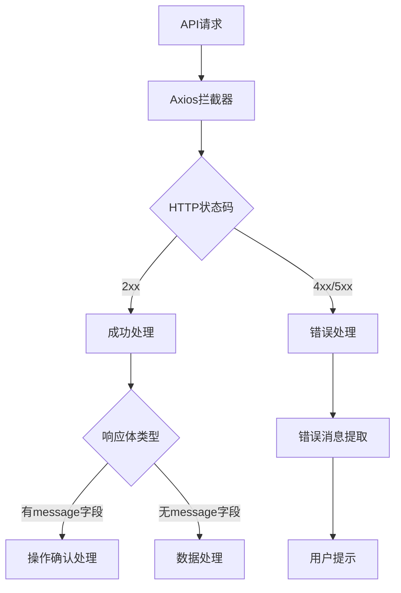

# API响应标准化设计文档

## 概述

本文档定义了AI数据库管理系统前后端API响应格式的标准化规范。目标是简化响应结构，提高开发效率，并统一错误处理机制。

### 设计目标

- 简化响应格式，去除冗余的success字段和外层data包装
- 使用HTTP状态码表示请求状态，JSON中不包含statusCode
- 统一错误处理和成功响应格式
- 保持向后兼容性，平滑迁移现有代码

## 新响应格式规范

### 成功响应格式

**有数据返回的成功响应：**
```json
{
  "id": "user123",
  "username": "admin",
  "email": "admin@example.com",
  "role": "admin"
}
```

**无数据返回的成功响应：**
```json
{
  "message": "操作成功完成"
}
```

### 错误响应格式

**标准错误响应：**
```json
{
  "message": "用户名和密码不能为空",
  "timestamp": "2024-01-15T08:30:00.000Z",
  "path": "/api/v1/users/auth/login"
}
```

**开发环境错误响应（包含调试信息）：**
```json
{
  "message": "数据库连接失败",
  "error": "ConnectionError: Connection timeout",
  "stack": "Error: Connection timeout\n    at Database.connect...",
  "timestamp": "2024-01-15T08:30:00.000Z",
  "path": "/api/v1/connections"
}
```

## 响应类型分类

### 1. 数据响应类型

| 场景 | HTTP状态码 | 响应格式 | 示例 |
|------|------------|----------|------|
| 获取单个资源 | 200 | 直接返回资源对象 | `{ "id": "123", "name": "用户名" }` |
| 获取资源列表 | 200 | 直接返回数组 | `[{ "id": "1" }, { "id": "2" }]` |
| 分页数据 | 200 | 包含数据和分页信息的对象 | `{ "data": [...], "pagination": {...} }` |
| 创建资源 | 201 | 直接返回创建的资源 | `{ "id": "new123", "status": "active" }` |

### 2. 操作确认类型

| 场景 | HTTP状态码 | 响应格式 |
|------|------------|----------|
| 更新成功 | 200 | `{ "message": "更新成功" }` |
| 删除成功 | 200 | `{ "message": "删除成功" }` |
| 操作完成 | 200 | `{ "message": "操作完成" }` |

### 3. 错误响应类型

| 错误类型 | HTTP状态码 | 说明 |
|----------|------------|------|
| 请求参数错误 | 400 | 参数验证失败、格式错误等 |
| 认证失败 | 401 | 未登录、token无效等 |
| 权限不足 | 403 | 无权限访问资源 |
| 资源不存在 | 404 | 请求的资源不存在 |
| 数据冲突 | 409 | 数据已存在、状态冲突等 |
| 服务器错误 | 500 | 数据库错误、系统异常等 |

## 实现架构

### 后端实现架构

```mermaid
graph TD
    A[路由处理器] --> B[业务逻辑层]
    B --> C{操作结果}
    C -->|成功且有数据| D[直接返回数据]
    C -->|成功无数据| E[返回消息确认]
    C -->|操作失败| F[抛出异常]
    F --> G[全局错误处理中间件]
    G --> H[标准化错误响应]
    D --> I[res.status(200)]
    E --> I
    H --> J[res.status(错误码)]
```

### 前端处理架构



## 技术实现方案

### 后端改造方案

#### 1. 响应工具类设计

```typescript
// src/utils/response.ts
export class ResponseUtils {
  // 成功响应 - 有数据
  static success<T>(data: T): T {
    return data;
  }
  
  // 成功响应 - 无数据
  static message(message: string) {
    return { message };
  }
  
  // 错误响应通过抛出异常处理
}
```

#### 2. 自定义错误类增强

```typescript
// src/types/errors.ts
export class AppError extends Error {
  public readonly statusCode: number;
  public readonly isOperational: boolean;
  public readonly path?: string;
  
  constructor(
    message: string, 
    statusCode: number = 500, 
    isOperational: boolean = true,
    path?: string
  ) {
    super(message);
    this.statusCode = statusCode;
    this.isOperational = isOperational;
    this.path = path;
  }
}
```

#### 3. 全局错误处理中间件改造

主要修改：
- 移除success字段
- 移除JSON中的statusCode字段，直接使用res.status()设置HTTP状态码
- 简化错误响应结构

#### 4. 路由处理器改造示例

```typescript
// 改造前
res.json({
  success: true,
  data: user,
  message: '获取用户信息成功'
});

// 改造后 - 有数据
res.status(200).json(user);

// 改造后 - 无数据确认
res.status(200).json({ message: '操作成功' });

// 改造后 - 错误响应
res.status(400).json({ 
  message: '请求参数错误',
  timestamp: new Date().toISOString(),
  path: req.url
});
```

### 前端改造方案

#### 1. API响应类型重新定义

```typescript
// src/types/api.ts
// 移除原有ApiResponse，使用原生类型
export type ApiSuccessResponse<T> = T;
export type ApiMessageResponse = {
  message: string;
};
export type ApiErrorResponse = {
  message: string;
  timestamp: string;
  path: string;
  error?: string;
  stack?: string;
};
```

#### 2. Axios拦截器改造

主要修改：
- 响应拦截器适配新格式
- 错误处理逻辑调整
- 移除对success字段的依赖

#### 3. Store层改造

修改所有API调用，适配新的响应格式：
- 移除对response.success的检查
- 直接使用响应数据
- 错误处理通过catch捕获

## 改造实施计划

### 阶段一：后端基础架构改造

1. **响应工具类实现**
   - 创建ResponseUtils工具类
   - 实现成功响应和错误响应的标准化方法

2. **错误处理中间件改造**
   - 修改errorHandler中间件
   - 移除success字段，使用statusCode

3. **类型定义更新**
   - 更新ApiResponse类型定义
   - 创建新的错误类型

### 阶段二：路由处理器改造

1. **用户相关路由改造**
   - 修改用户认证、获取、更新等API
   - 适配新的响应格式

2. **API密钥管理路由改造**
   - 修改密钥创建、查询、更新、删除API
   - 统一响应格式

3. **系统路由改造**
   - 修改健康检查、信息查询等API
   - 确保格式一致性

### 阶段三：前端适配改造

1. **类型定义更新**
   - 更新前端API响应类型
   - 移除ApiResponse接口

2. **API工具类改造**
   - 修改Axios拦截器
   - 更新错误处理逻辑

3. **Store层改造**
   - 修改所有API调用逻辑
   - 适配新的响应格式

### 阶段四：测试与验证

1. **单元测试更新**
   - 更新所有API相关测试用例
   - 验证新格式的正确性

2. **集成测试**
   - 端到端测试验证
   - 确保前后端协调工作

## 迁移兼容性考虑

### 渐进式迁移策略

1. **新旧格式并存期**
   - 保留旧的ApiResponse类型作为备用
   - 逐步迁移现有接口到新格式

2. **向后兼容处理**
   - 前端同时支持两种格式的响应处理
   - 根据响应内容自动识别格式类型

### 风险控制措施

1. **分批次部署**
   - 先部署后端改造
   - 再部署前端适配
   - 最后清理旧代码

2. **回滚方案**
   - 保留原有实现的分支
   - 制定快速回滚流程
   - 监控系统稳定性

## 验证标准

### 功能验证标准

1. **响应格式验证**
   - 成功响应直接返回数据或包含message的确认信息
   - 错误响应包含message、timestamp、path字段
   - HTTP状态码通过res.status()设置，不在JSON中重复

2. **HTTP状态码验证**
   - 2xx状态码对应成功响应
   - 4xx/5xx状态码对应错误响应
   - 状态码与响应内容保持一致

3. **前端适配验证**
   - API调用正常工作
   - 错误处理正确显示
   - 用户交互无异常

### 性能验证标准

1. **响应体积优化**
   - 移除冗余字段后响应体积减少
   - 网络传输效率提升

2. **处理性能**
   - 前端处理逻辑简化
   - 响应解析性能无退化

## 文档更新要求

### API文档更新

1. **接口文档**
   - 更新所有API接口的响应示例
   - 标注新格式说明

2. **错误码文档**
   - 整理所有可能的statusCode
   - 提供错误处理指南

### 开发文档更新

1. **开发规范**
   - 更新API开发规范
   - 提供响应格式模板

2. **迁移指南**
   - 提供详细的代码迁移示例
   - 常见问题解答