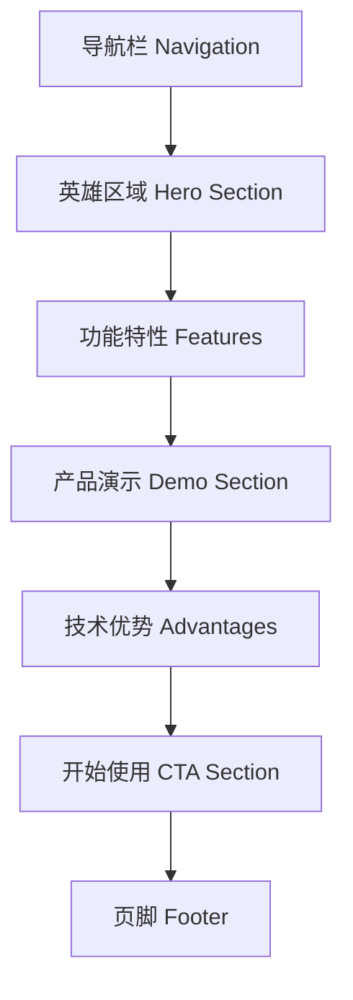

# AI数据库管理系统 - 项目主页设计文档

## 1. 项目概述

### 1.1 设计目标
为AI数据库管理系统设计一个现代化、简洁、大方的项目主页，作为用户进入系统的入口，同时介绍项目的核心功能和价值。

### 1.2 设计理念
- **简洁大方**: 避免过度装饰，突出核心功能
- **灵动设计**: 通过动效和交互增强用户体验
- **设计感**: 现代化的视觉语言和空间布局
- **一致性**: 建立统一的设计系统，为后续页面奠定基础

### 1.3 核心色彩体系
- **主色调**: 白色(#FFFFFF) - 纯净、专业
- **辅助色**: 黑色(#000000) - 稳重、技术感  
- **强调色**: 绿色(#10B981) - 活力、成长、智能
- **支持明暗主题切换**

## 2. 设计系统规范

### 2.1 色彩规范

#### 2.1.1 明亮主题
```css
/* 主色彩 */
--primary-50: #F0FDF4;    /* 极浅绿 */
--primary-100: #DCFCE7;   /* 浅绿背景 */
--primary-500: #10B981;   /* 标准绿 */
--primary-600: #059669;   /* 深绿 */
--primary-900: #064E3B;   /* 极深绿 */

/* 中性色 */
--gray-50: #F9FAFB;       /* 背景色 */
--gray-100: #F3F4F6;      /* 卡片背景 */
--gray-400: #9CA3AF;      /* 辅助文本 */
--gray-900: #111827;      /* 主文本 */

/* 语义色 */
--white: #FFFFFF;
--black: #000000;
```

#### 2.1.2 暗黑主题
```css
/* 主色彩 */
--primary-50: #064E3B;    /* 深绿背景 */
--primary-100: #065F46;   /* 深绿卡片 */
--primary-500: #10B981;   /* 标准绿(保持) */
--primary-600: #34D399;   /* 亮绿 */
--primary-900: #D1FAE5;   /* 极浅绿 */

/* 中性色 */
--gray-50: #111827;       /* 背景色 */
--gray-100: #1F2937;      /* 卡片背景 */
--gray-400: #6B7280;      /* 辅助文本 */
--gray-900: #F9FAFB;      /* 主文本 */
```

### 2.2 字体规范

#### 2.2.1 字体族
```css
--font-primary: 'Inter', -apple-system, BlinkMacSystemFont, 'Segoe UI', sans-serif;
--font-mono: 'JetBrains Mono', 'Monaco', 'Consolas', monospace;
```

#### 2.2.2 字体尺寸
```css
--text-xs: 0.75rem;    /* 12px - 标签文字 */
--text-sm: 0.875rem;   /* 14px - 辅助文字 */
--text-base: 1rem;     /* 16px - 正文 */
--text-lg: 1.125rem;   /* 18px - 小标题 */
--text-xl: 1.25rem;    /* 20px - 标题 */
--text-2xl: 1.5rem;    /* 24px - 大标题 */
--text-3xl: 1.875rem;  /* 30px - 主标题 */
--text-4xl: 2.25rem;   /* 36px - 特大标题 */
--text-5xl: 3rem;      /* 48px - 英雄标题 */
```

### 2.3 间距规范
```css
--space-1: 0.25rem;    /* 4px */
--space-2: 0.5rem;     /* 8px */
--space-3: 0.75rem;    /* 12px */
--space-4: 1rem;       /* 16px */
--space-6: 1.5rem;     /* 24px */
--space-8: 2rem;       /* 32px */
--space-12: 3rem;      /* 48px */
--space-16: 4rem;      /* 64px */
--space-20: 5rem;      /* 80px */
```

### 2.4 圆角规范
```css
--radius-sm: 0.375rem;  /* 6px - 小元素 */
--radius-md: 0.5rem;    /* 8px - 按钮 */
--radius-lg: 0.75rem;   /* 12px - 卡片 */
--radius-xl: 1rem;      /* 16px - 大卡片 */
--radius-2xl: 1.5rem;   /* 24px - 容器 */
```

### 2.5 阴影规范
```css
--shadow-sm: 0 1px 2px 0 rgba(0, 0, 0, 0.05);
--shadow-md: 0 4px 6px -1px rgba(0, 0, 0, 0.1);
--shadow-lg: 0 10px 15px -3px rgba(0, 0, 0, 0.1);
--shadow-xl: 0 20px 25px -5px rgba(0, 0, 0, 0.1);
```

## 3. 主页架构设计

### 3.1 页面布局结构



### 3.2 响应式断点设计
```css
/* 断点定义 */
--breakpoint-sm: 640px;   /* 手机 */
--breakpoint-md: 768px;   /* 平板 */
--breakpoint-lg: 1024px;  /* 桌面 */
--breakpoint-xl: 1280px;  /* 大屏 */
--breakpoint-2xl: 1536px; /* 超大屏 */
```

## 4. 组件设计规范

### 4.1 导航栏组件 (Navigation)

#### 4.1.1 设计要求
- 固定顶部，支持滚动时变化
- 左侧品牌Logo，右侧功能菜单
- 主题切换按钮
- 移动端汉堡菜单

#### 4.1.2 组件结构
```vue
<template>
  <nav class="navbar">
    <div class="navbar-container">
      <!-- 品牌Logo -->
      <div class="navbar-brand">
        <div class="logo-icon">AI</div>
        <span class="logo-text">数据库管理</span>
      </div>
      
      <!-- 导航菜单 -->
      <div class="navbar-menu">
        <a href="#features" class="nav-link">功能特性</a>
        <a href="#demo" class="nav-link">产品演示</a>
        <a href="#advantages" class="nav-link">技术优势</a>
      </div>
      
      <!-- 操作区域 -->
      <div class="navbar-actions">
        <button class="theme-toggle" @click="toggleTheme">
          <Sun v-if="isDark" />
          <Moon v-else />
        </button>
        <button class="btn-primary">开始使用</button>
      </div>
    </div>
  </nav>
</template>
```

#### 4.1.3 样式规范
```css
.navbar {
  @apply fixed top-0 w-full z-50 bg-white/80 dark:bg-gray-900/80;
  @apply backdrop-blur-md border-b border-gray-200 dark:border-gray-800;
  transition: all 0.3s ease;
}

.navbar-container {
  @apply max-w-7xl mx-auto px-4 sm:px-6 lg:px-8;
  @apply flex items-center justify-between h-16;
}

.navbar-brand {
  @apply flex items-center space-x-3;
}

.logo-icon {
  @apply w-8 h-8 bg-primary-500 rounded-lg;
  @apply flex items-center justify-center text-white font-bold;
}

.nav-link {
  @apply text-gray-600 hover:text-primary-500 dark:text-gray-300;
  @apply px-3 py-2 rounded-md text-sm font-medium;
  transition: color 0.2s ease;
}
```

### 4.2 英雄区域组件 (Hero Section)

#### 4.2.1 设计要求
- 大标题 + 副标题 + 描述文字
- 主要操作按钮
- 视觉展示区域（截图/动画）
- 响应式布局

#### 4.2.2 组件结构
```vue
<template>
  <section class="hero-section">
    <div class="hero-container">
      <div class="hero-content">
        <div class="hero-text">
          <h1 class="hero-title">
            AI驱动的
            <span class="text-gradient">智能数据库</span>
            管理平台
          </h1>
          <p class="hero-subtitle">
            通过自然语言轻松管理数据库，让数据操作变得简单直观
          </p>
          <div class="hero-features">
            <div class="feature-item">
              <CheckCircle class="feature-icon" />
              <span>自然语言查询</span>
            </div>
            <div class="feature-item">
              <CheckCircle class="feature-icon" />
              <span>多数据库支持</span>
            </div>
            <div class="feature-item">
              <CheckCircle class="feature-icon" />
              <span>智能优化建议</span>
            </div>
          </div>
          <div class="hero-actions">
            <button class="btn-primary btn-lg">立即体验</button>
            <button class="btn-secondary btn-lg">查看演示</button>
          </div>
        </div>
        <div class="hero-visual">
          <div class="visual-container">
            <!-- 产品截图或动画 -->
            <div class="screenshot-placeholder">
              <div class="mock-window">
                <div class="window-header">
                  <div class="window-controls">
                    <div class="control red"></div>
                    <div class="control yellow"></div>
                    <div class="control green"></div>
                  </div>
                </div>
                <div class="window-content">
                  <div class="code-line">SELECT * FROM users WHERE ...</div>
                  <div class="code-line">→ AI正在为您优化查询...</div>
                  <div class="code-line success">✓ 查询优化完成</div>
                </div>
              </div>
            </div>
          </div>
        </div>
      </div>
    </div>
  </section>
</template>
```

#### 4.2.3 样式规范
```css
.hero-section {
  @apply min-h-screen flex items-center;
  @apply bg-gradient-to-br from-gray-50 to-gray-100;
  @apply dark:from-gray-900 dark:to-gray-800;
  @apply pt-16; /* 导航栏高度 */
}

.hero-container {
  @apply max-w-7xl mx-auto px-4 sm:px-6 lg:px-8 py-20;
}

.hero-content {
  @apply grid lg:grid-cols-2 gap-12 items-center;
}

.hero-title {
  @apply text-4xl md:text-5xl lg:text-6xl font-bold;
  @apply text-gray-900 dark:text-white leading-tight;
}

.text-gradient {
  @apply bg-gradient-to-r from-primary-500 to-green-600;
  @apply bg-clip-text text-transparent;
}

.hero-subtitle {
  @apply text-lg md:text-xl text-gray-600 dark:text-gray-300;
  @apply mt-6 max-w-2xl;
}
```

### 4.3 功能特性组件 (Features)

#### 4.3.1 设计要求
- 3x2网格布局展示6个核心功能
- 每个功能卡片包含图标、标题、描述
- 悬停动效

#### 4.3.2 功能列表
1. **自然语言查询** - 用自然语言描述需求，AI自动生成SQL
2. **多数据库支持** - 支持MySQL、PostgreSQL、MongoDB等
3. **智能优化** - AI提供查询优化和索引建议  
4. **可视化分析** - 查询结果图表化展示
5. **权限管控** - 细粒度的用户权限管理
6. **审计日志** - 完整的操作记录和审计追踪

#### 4.3.3 组件结构
```vue
<template>
  <section class="features-section">
    <div class="features-container">
      <div class="section-header">
        <h2 class="section-title">强大功能特性</h2>
        <p class="section-subtitle">
          提供全方位的数据库管理解决方案
        </p>
      </div>
      
      <div class="features-grid">
        <div 
          v-for="feature in features" 
          :key="feature.id"
          class="feature-card"
        >
          <div class="feature-icon-wrapper">
            <component :is="feature.icon" class="feature-icon" />
          </div>
          <h3 class="feature-title">{{ feature.title }}</h3>
          <p class="feature-description">{{ feature.description }}</p>
        </div>
      </div>
    </div>
  </section>
</template>
```

### 4.4 按钮组件规范

#### 4.4.1 主要按钮 (Primary Button)
```css
.btn-primary {
  @apply bg-primary-500 hover:bg-primary-600 text-white;
  @apply px-6 py-3 rounded-lg font-medium;
  @apply transition-all duration-200 transform hover:scale-105;
  @apply shadow-md hover:shadow-lg;
}
```

#### 4.4.2 次要按钮 (Secondary Button)  
```css
.btn-secondary {
  @apply bg-transparent border-2 border-gray-300 hover:border-primary-500;
  @apply text-gray-700 hover:text-primary-500 dark:text-gray-300;
  @apply px-6 py-3 rounded-lg font-medium;
  @apply transition-all duration-200;
}
```

#### 4.4.3 幽灵按钮 (Ghost Button)
```css
.btn-ghost {
  @apply bg-transparent hover:bg-primary-50 dark:hover:bg-primary-900/20;
  @apply text-primary-500 hover:text-primary-600;
  @apply px-4 py-2 rounded-lg font-medium;
  @apply transition-all duration-200;
}
```

## 5. 动效设计

### 5.1 页面加载动效
```css
/* 淡入动画 */
@keyframes fadeInUp {
  from {
    opacity: 0;
    transform: translateY(30px);
  }
  to {
    opacity: 1;
    transform: translateY(0);
  }
}

.fade-in-up {
  animation: fadeInUp 0.6s ease-out;
}
```

### 5.2 交互动效
```css
/* 悬停放大 */
.hover-scale {
  transition: transform 0.2s ease;
}

.hover-scale:hover {
  transform: scale(1.05);
}

/* 按钮涟漪效果 */
.btn-ripple {
  position: relative;
  overflow: hidden;
}

.btn-ripple::before {
  content: '';
  position: absolute;
  top: 50%;
  left: 50%;
  width: 0;
  height: 0;
  border-radius: 50%;
  background: rgba(255, 255, 255, 0.5);
  transition: width 0.6s, height 0.6s;
  transform: translate(-50%, -50%);
}

.btn-ripple:active::before {
  width: 300px;
  height: 300px;
}
```

### 5.3 滚动视差效果
```css
/* 视差滚动 */
.parallax {
  transform: translateY(var(--scroll-y) * 0.5);
}
```

## 6. 响应式设计

### 6.1 移动端适配 (< 768px)
- 导航栏汉堡菜单
- 英雄区域单列布局
- 功能特性2列网格
- 按钮全宽显示

### 6.2 平板适配 (768px - 1024px)  
- 英雄区域单列布局，增大间距
- 功能特性2x3网格
- 适中的字体大小

### 6.3 桌面端 (> 1024px)
- 英雄区域双列布局
- 功能特性3x2网格
- 最佳的视觉体验

## 7. 主题切换实现

### 7.1 主题状态管理
```typescript
// 主题管理 Store
interface ThemeState {
  isDark: boolean;
  systemPreference: 'light' | 'dark';
  userPreference: 'light' | 'dark' | 'auto';
}

const useThemeStore = () => {
  const toggleTheme = () => {
    const newTheme = isDark.value ? 'light' : 'dark';
    setTheme(newTheme);
  };
  
  const setTheme = (theme: 'light' | 'dark' | 'auto') => {
    if (theme === 'auto') {
      // 跟随系统
      const systemDark = window.matchMedia('(prefers-color-scheme: dark)').matches;
      applyTheme(systemDark ? 'dark' : 'light');
    } else {
      applyTheme(theme);
    }
  };
  
  const applyTheme = (theme: 'light' | 'dark') => {
    if (theme === 'dark') {
      document.documentElement.classList.add('dark');
    } else {
      document.documentElement.classList.remove('dark');
    }
  };
};
```

### 7.2 主题切换按钮
```vue
<template>
  <button 
    @click="toggleTheme"
    class="theme-toggle"
    :aria-label="isDark ? '切换到浅色主题' : '切换到深色主题'"
  >
    <transition name="icon-fade" mode="out-in">
      <Sun v-if="isDark" key="sun" class="w-5 h-5" />
      <Moon v-else key="moon" class="w-5 h-5" />
    </transition>
  </button>
</template>

<style>
.theme-toggle {
  @apply p-2 rounded-lg bg-gray-100 hover:bg-gray-200;
  @apply dark:bg-gray-800 dark:hover:bg-gray-700;
  @apply transition-colors duration-200;
}

.icon-fade-enter-active,
.icon-fade-leave-active {
  transition: opacity 0.2s ease;
}

.icon-fade-enter-from,
.icon-fade-leave-to {
  opacity: 0;
}
</style>
```

## 8. 性能优化策略

### 8.1 图片优化
- 使用WebP格式，提供降级方案
- 实施懒加载
- 响应式图片（不同尺寸设备加载不同分辨率）

### 8.2 代码分割
```typescript
// 路由懒加载
const Home = () => import('@/views/Home.vue');
const Dashboard = () => import('@/views/Dashboard.vue');
```

### 8.3 CSS优化
- 移除未使用的CSS
- 关键CSS内联
- 非关键CSS异步加载

## 9. 可访问性设计

### 9.1 键盘导航
- Tab键顺序合理
- 焦点指示清晰
- 快捷键支持

### 9.2 屏幕阅读器
- 语义化HTML标签
- aria-label属性
- alt文本描述

### 9.3 色彩对比
- 文本对比度 ≥ 4.5:1
- 重要元素对比度 ≥ 7:1
- 色盲友好设计

## 10. 实施计划

### 10.1 第一阶段 - 基础框架
1. 建立设计系统和组件库
2. 实现导航栏和主题切换
3. 完成英雄区域布局

### 10.2 第二阶段 - 内容完善  
1. 实现功能特性展示
2. 添加产品演示区域
3. 完成响应式适配

### 10.3 第三阶段 - 优化提升
1. 添加动效和交互
2. 性能优化和测试
3. 可访问性完善
