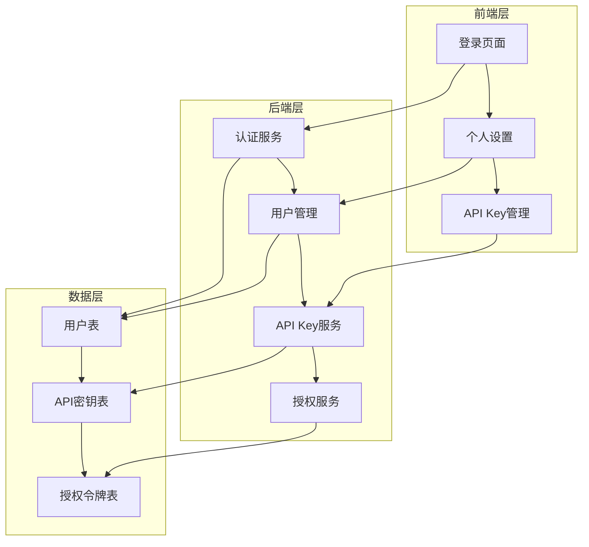
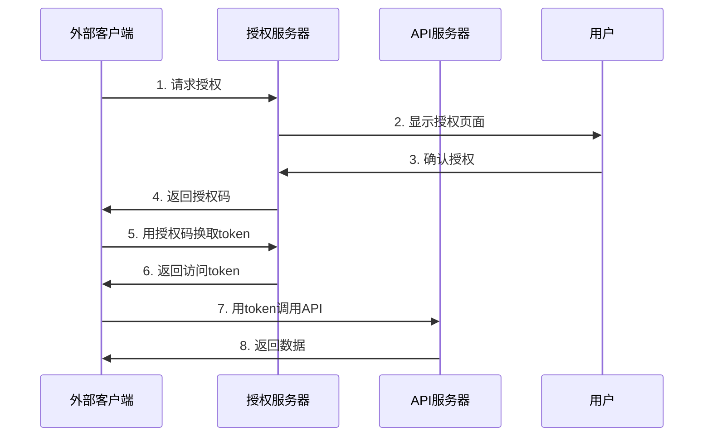

# 用户模块完善设计文档

## 1. 概述

### 1.1 设计目标
完善AI数据库管理系统的用户模块，包括:
- 统一风格的前端登录界面重构
- 初始化数据脚本提供默认账号
- API Key管理功能
- 外部授权登录机制

### 1.2 技术架构



## 2. 数据库设计

### 2.1 核心表结构

```sql
-- 用户表扩展
CREATE TABLE users (
    id INTEGER PRIMARY KEY AUTOINCREMENT,
    username TEXT UNIQUE NOT NULL,
    email TEXT UNIQUE NOT NULL,
    password_hash TEXT NOT NULL,
    salt TEXT NOT NULL,
    role TEXT NOT NULL DEFAULT 'user',        -- admin|user|readonly|guest
    status TEXT NOT NULL DEFAULT 'active',    -- active|inactive|locked
    display_name TEXT,
    avatar_url TEXT,
    settings TEXT,                             -- JSON格式用户设置
    last_login_at DATETIME,
    login_count INTEGER DEFAULT 0,
    created_at DATETIME DEFAULT CURRENT_TIMESTAMP,
    updated_at DATETIME DEFAULT CURRENT_TIMESTAMP
);

-- API密钥表
CREATE TABLE api_keys (
    id INTEGER PRIMARY KEY AUTOINCREMENT,
    user_id INTEGER NOT NULL,
    name TEXT NOT NULL,                        -- 密钥名称
    key_id TEXT UNIQUE NOT NULL,               -- 公开的密钥ID
    key_secret TEXT NOT NULL,                  -- 加密存储的密钥
    permissions TEXT,                          -- JSON格式权限列表
    last_used_at DATETIME,
    usage_count INTEGER DEFAULT 0,
    expires_at DATETIME,                       -- 过期时间
    is_active BOOLEAN DEFAULT TRUE,
    created_at DATETIME DEFAULT CURRENT_TIMESTAMP,
    FOREIGN KEY (user_id) REFERENCES users(id) ON DELETE CASCADE
);

-- 授权令牌表
CREATE TABLE auth_tokens (
    id INTEGER PRIMARY KEY AUTOINCREMENT,
    user_id INTEGER,
    token TEXT UNIQUE NOT NULL,
    token_type TEXT NOT NULL,                  -- jwt|oauth|temporary
    scope TEXT,                                -- JSON格式授权范围
    client_info TEXT,                          -- JSON格式客户端信息
    expires_at DATETIME NOT NULL,
    is_revoked BOOLEAN DEFAULT FALSE,
    created_at DATETIME DEFAULT CURRENT_TIMESTAMP,
    FOREIGN KEY (user_id) REFERENCES users(id) ON DELETE CASCADE
);

-- 登录日志表
CREATE TABLE login_logs (
    id INTEGER PRIMARY KEY AUTOINCREMENT,
    user_id INTEGER,
    username TEXT,
    ip_address TEXT,
    user_agent TEXT,
    login_method TEXT,                         -- password|api_key|oauth
    success BOOLEAN NOT NULL,
    failure_reason TEXT,
    created_at DATETIME DEFAULT CURRENT_TIMESTAMP,
    FOREIGN KEY (user_id) REFERENCES users(id) ON DELETE SET NULL
);

-- 索引优化
CREATE INDEX idx_users_username ON users(username);
CREATE INDEX idx_users_email ON users(email);
CREATE INDEX idx_api_keys_user_id ON api_keys(user_id);
CREATE INDEX idx_api_keys_key_id ON api_keys(key_id);
CREATE INDEX idx_auth_tokens_token ON auth_tokens(token);
```

### 2.2 TypeScript类型定义

```typescript
// 用户相关类型
export interface User {
  id: string;
  username: string;
  email: string;
  role: UserRole;
  status: UserStatus;
  displayName?: string;
  avatarUrl?: string;
  settings?: UserSettings;
  lastLoginAt?: string;
  loginCount?: number;
  createdAt: string;
  updatedAt: string;
}

export type UserRole = 'admin' | 'user' | 'readonly' | 'guest';
export type UserStatus = 'active' | 'inactive' | 'locked';

export interface UserSettings {
  theme: 'light' | 'dark' | 'auto';
  language: string;
  timezone: string;
  notifications: {
    email: boolean;
    browser: boolean;
    security: boolean;
  };
}

// API Key相关类型
export interface ApiKey {
  id: string;
  userId: string;
  name: string;
  keyId: string;
  permissions?: string[];
  lastUsedAt?: string;
  usageCount: number;
  expiresAt?: string;
  isActive: boolean;
  createdAt: string;
}

export interface CreateApiKeyRequest {
  name: string;
  permissions?: string[];
  expiresAt?: string;
}

export interface CreateApiKeyResponse {
  apiKey: ApiKey;
  secret: string; // 仅在创建时返回
}

// 授权相关类型
export interface AuthorizationToken {
  id: string;
  userId?: string;
  token: string;
  tokenType: 'jwt' | 'oauth' | 'temporary';
  scope?: string[];
  clientInfo?: {
    name?: string;
    ip?: string;
    userAgent?: string;
  };
  expiresAt: string;
  isRevoked: boolean;
  createdAt: string;
}
```

## 3. 前端登录界面重构

### 3.1 统一设计风格

采用项目现有的设计系统，遵循简洁、大方、灵动的设计理念，主色调为白、黑、绿。

#### 3.1.1 登录页面组件

```vue
<template>
  <div class="login-container">
    <!-- 背景装饰 -->
    <div class="login-background">
      <div class="bg-pattern"></div>
      <div class="bg-gradient"></div>
    </div>
    
    <!-- 主要内容 -->
    <div class="login-content">
      <!-- 品牌区域 -->
      <div class="brand-section">
        <div class="brand-logo">
          <div class="logo-icon">
            <div class="ai-symbol">AI</div>
          </div>
          <div class="logo-text">
            <h1 class="brand-title">AI数据库管理</h1>
            <p class="brand-subtitle">智能化数据库操作平台</p>
          </div>
        </div>
      </div>
      
      <!-- 登录表单 -->
      <div class="form-section">
        <div class="form-container">
          <div class="form-header">
            <h2 class="form-title">欢迎回来</h2>
            <p class="form-subtitle">请登录您的账户继续使用</p>
          </div>
          
          <form @submit.prevent="handleLogin" class="login-form">
            <!-- 用户名输入 -->
            <div class="form-group">
              <label class="form-label">用户名或邮箱</label>
              <div class="form-input-wrapper">
                <UserIcon class="input-icon" />
                <input
                  v-model="loginForm.username"
                  type="text"
                  class="form-input"
                  placeholder="请输入用户名或邮箱"
                  :class="{ 'error': errors.username }"
                />
              </div>
              <div v-if="errors.username" class="form-error">
                {{ errors.username }}
              </div>
            </div>
            
            <!-- 密码输入 -->
            <div class="form-group">
              <label class="form-label">密码</label>
              <div class="form-input-wrapper">
                <LockIcon class="input-icon" />
                <input
                  v-model="loginForm.password"
                  :type="showPassword ? 'text' : 'password'"
                  class="form-input"
                  placeholder="请输入密码"
                  :class="{ 'error': errors.password }"
                />
                <button
                  type="button"
                  class="password-toggle"
                  @click="showPassword = !showPassword"
                >
                  <EyeIcon v-if="showPassword" />
                  <EyeSlashIcon v-else />
                </button>
              </div>
              <div v-if="errors.password" class="form-error">
                {{ errors.password }}
              </div>
            </div>
            
            <!-- 记住我和忘记密码 -->
            <div class="form-options">
              <label class="checkbox-wrapper">
                <input v-model="rememberMe" type="checkbox" class="checkbox-input" />
                <div class="checkbox-custom"></div>
                <span class="checkbox-label">记住我</span>
              </label>
              <a href="#" class="forgot-password">忘记密码？</a>
            </div>
            
            <!-- 登录按钮 -->
            <button type="submit" class="login-button" :disabled="isLoading">
              <LoadingIcon v-if="isLoading" class="loading-icon" />
              <span>{{ isLoading ? '登录中...' : '登录' }}</span>
            </button>
            
            <!-- 注册链接 -->
            <div class="register-link">
              <span>还没有账户？</span>
              <router-link to="/register" class="register-btn">立即注册</router-link>
            </div>
          </form>
        </div>
      </div>
    </div>
    
    <!-- 主题切换 -->
    <button class="theme-toggle" @click="toggleTheme">
      <SunIcon v-if="isDark" />
      <MoonIcon v-else />
    </button>
  </div>
</template>
```

#### 3.1.2 样式实现

遵循项目TailwindCSS 4.1配置规范：

```vue
<style scoped>
@reference '../styles/main.css';

.login-container {
  @apply min-h-screen relative overflow-hidden;
  background: linear-gradient(135deg, #f9fafb 0%, #f3f4f6 100%);
}

.dark .login-container {
  background: linear-gradient(135deg, #111827 0%, #1f2937 100%);
}

.form-input {
  @apply w-full pl-10 pr-10 py-3 border border-gray-300 dark:border-gray-600;
  @apply rounded-lg bg-white dark:bg-gray-700 text-gray-900 dark:text-white;
  @apply transition-all duration-200;
}

.form-input:focus {
  @apply ring-2 border-transparent;
  --tw-ring-color: var(--color-primary-500);
}

.login-button {
  @apply w-full text-white font-medium py-3 px-4 rounded-lg;
  @apply transition-all duration-200 transform hover:scale-105;
  @apply disabled:opacity-50 disabled:cursor-not-allowed;
  @apply flex items-center justify-center gap-2;
  background-color: var(--color-primary-500);
}
</style>
```

主样式文件配置：
```css
/* frontend/src/styles/main.css */
@import "tailwindcss";

@theme {
  --color-primary-500: #10b981;
  --color-primary-600: #059669;
}
```

### 3.2 表单验证逻辑

```typescript
// composables/useLoginForm.ts
import { ref, reactive, computed } from 'vue';
import { useRouter } from 'vue-router';
import { useAuthStore } from '@/stores/auth';

export function useLoginForm() {
  const router = useRouter();
  const authStore = useAuthStore();
  
  const loginForm = reactive({
    username: '',
    password: ''
  });
  
  const isLoading = ref(false);
  const showPassword = ref(false);
  const rememberMe = ref(false);
  const errors = reactive({
    username: '',
    password: ''
  });
  
  const isFormValid = computed(() => {
    return loginForm.username.length >= 3 && loginForm.password.length >= 6;
  });
  
  const handleLogin = async () => {
    if (!isFormValid.value) return;
    
    try {
      isLoading.value = true;
      
      await authStore.login({
        username: loginForm.username,
        password: loginForm.password,
        rememberMe: rememberMe.value
      });
      
      router.push('/app/dashboard');
      
    } catch (error: any) {
      if (error.code === 'INVALID_CREDENTIALS') {
        errors.username = '用户名或密码错误';
        errors.password = '用户名或密码错误';
      } else {
        errors.username = error.message || '登录失败，请稍后重试';
      }
    } finally {
      isLoading.value = false;
    }
  };
  
  return {
    loginForm,
    isLoading,
    showPassword,
    rememberMe,
    errors,
    isFormValid,
    handleLogin
  };
}
```

## 4. 初始化数据脚本

### 4.1 默认用户数据

```typescript
// scripts/init-users.ts
import bcrypt from 'bcrypt';
import { Database } from 'better-sqlite3';

interface DefaultUser {
  username: string;
  email: string;
  password: string;
  role: string;
  displayName: string;
  status: string;
}

const defaultUsers: DefaultUser[] = [
  {
    username: 'admin',
    email: 'admin@example.com',
    password: 'admin123456',
    role: 'admin',
    displayName: '系统管理员',
    status: 'active'
  },
  {
    username: 'user',
    email: 'user@example.com',
    password: 'user123456',
    role: 'user', 
    displayName: '普通用户',
    status: 'active'
  },
  {
    username: 'readonly',
    email: 'readonly@example.com',
    password: 'readonly123456',
    role: 'readonly',
    displayName: '只读用户',
    status: 'active'
  },
  {
    username: 'guest',
    email: 'guest@example.com',
    password: 'guest123456',
    role: 'guest',
    displayName: '访客用户',
    status: 'active'
  }
];

async function initializeUsers(db: Database) {
  console.log('初始化默认用户数据...');
  
  for (const userData of defaultUsers) {
    // 检查用户是否已存在
    const existingUser = db.prepare('SELECT id FROM users WHERE username = ?').get(userData.username);
    
    if (existingUser) {
      console.log(`用户 ${userData.username} 已存在，跳过创建`);
      continue;
    }
    
    // 生成密码哈希
    const salt = await bcrypt.genSalt(12);
    const passwordHash = await bcrypt.hash(userData.password, salt);
    
    // 插入用户数据
    const insertUser = db.prepare(`
      INSERT INTO users (username, email, password_hash, salt, role, display_name, status)
      VALUES (?, ?, ?, ?, ?, ?, ?)
    `);
    
    insertUser.run(
      userData.username,
      userData.email,
      passwordHash,
      salt,
      userData.role,
      userData.displayName,
      userData.status
    );
    
    console.log(`✓ 创建用户: ${userData.username} (${userData.role})`);
  }
  
  console.log('默认用户初始化完成！');
  console.log('\n默认账号信息:');
  console.log('管理员: admin / admin123456');
  console.log('普通用户: user / user123456');
  console.log('只读用户: readonly / readonly123456');
  console.log('访客用户: guest / guest123456');
  console.log('\n⚠️  请及时修改默认密码！');
}

export { initializeUsers };
```

### 4.2 初始化脚本

根据项目脚本规范，将脚本放在scripts文件夹并完善说明文档：

```bash
#!/bin/bash
# scripts/init-database.sh
# 功能：初始化数据库结构和默认用户数据
# 使用：./scripts/init-database.sh
# 依赖：Node.js 22, SQLite

echo "=== AI数据库管理系统 - 数据库初始化 ==="

# 检查Node.js版本（项目要求Node.js 22）
if ! command -v node &> /dev/null; then
    echo "错误: 未找到Node.js，请安装Node.js 22"
    exit 1
fi

NODE_VERSION=$(node --version | cut -d'v' -f2 | cut -d'.' -f1)
if [ "$NODE_VERSION" -lt 22 ]; then
    echo "警告: Node.js版本为 $(node --version)，建议使用v22+"
fi

# 进入后端目录
cd backend || { echo "错误: backend目录不存在"; exit 1; }

# 安装依赖
echo "安装后端依赖..."
npm install || { echo "依赖安装失败"; exit 1; }

# 创建数据目录
mkdir -p ../data

# 运行初始化
echo "初始化数据库..."
npm run init-db || { echo "初始化失败"; exit 1; }

echo "=== 初始化完成 ==="
echo "默认账号: admin/admin123456, user/user123456"
echo "⚠️  请及时修改默认密码！"
```

## 5. API Key管理功能

### 5.1 后端API设计

```typescript
// routes/apiKeys.ts
import { Router } from 'express';
import { ApiKeyService } from '../services/ApiKeyService';
import { authMiddleware } from '../middleware/auth';

const router = Router();
const apiKeyService = new ApiKeyService();

// 获取用户的API密钥列表
router.get('/', authMiddleware, async (req, res) => {
  try {
    const userId = req.user.id;
    const apiKeys = await apiKeyService.getUserApiKeys(userId);
    
    res.json({
      success: true,
      data: apiKeys
    });
  } catch (error) {
    res.status(500).json({
      success: false,
      message: '获取API密钥失败'
    });
  }
});

// 创建新的API密钥
router.post('/', authMiddleware, async (req, res) => {
  try {
    const userId = req.user.id;
    const { name, permissions, expiresAt } = req.body;
    
    const result = await apiKeyService.createApiKey(userId, {
      name,
      permissions,
      expiresAt
    });
    
    res.json({
      success: true,
      data: result
    });
  } catch (error) {
    res.status(500).json({
      success: false,
      message: '创建API密钥失败'
    });
  }
});

// 删除API密钥
router.delete('/:keyId', authMiddleware, async (req, res) => {
  try {
    const userId = req.user.id;
    const { keyId } = req.params;
    
    await apiKeyService.deleteApiKey(userId, keyId);
    
    res.json({
      success: true,
      message: 'API密钥已删除'
    });
  } catch (error) {
    res.status(500).json({
      success: false,
      message: '删除API密钥失败'
    });
  }
});

export default router;
```

### 5.2 API Key服务实现

```typescript
// services/ApiKeyService.ts
import crypto from 'crypto';
import bcrypt from 'bcrypt';
import { Database } from 'better-sqlite3';

export class ApiKeyService {
  constructor(private db: Database) {}
  
  async createApiKey(userId: string, data: CreateApiKeyRequest): Promise<CreateApiKeyResponse> {
    // 生成密钥ID和Secret
    const keyId = this.generateKeyId();
    const keySecret = this.generateKeySecret();
    const hashedSecret = await bcrypt.hash(keySecret, 12);
    
    // 插入数据库
    const insertKey = this.db.prepare(`
      INSERT INTO api_keys (user_id, name, key_id, key_secret, permissions, expires_at)
      VALUES (?, ?, ?, ?, ?, ?)
    `);
    
    const result = insertKey.run(
      userId,
      data.name,
      keyId,
      hashedSecret,
      JSON.stringify(data.permissions || []),
      data.expiresAt || null
    );
    
    // 返回结果
    const apiKey = this.getApiKeyById(result.lastInsertRowid as number);
    
    return {
      apiKey,
      secret: keySecret // 仅在创建时返回
    };
  }
  
  async getUserApiKeys(userId: string): Promise<ApiKey[]> {
    const query = this.db.prepare(`
      SELECT id, user_id, name, key_id, permissions, last_used_at, 
             usage_count, expires_at, is_active, created_at
      FROM api_keys 
      WHERE user_id = ? AND is_active = 1
      ORDER BY created_at DESC
    `);
    
    const rows = query.all(userId);
    
    return rows.map(row => ({
      id: row.id.toString(),
      userId: row.user_id.toString(),
      name: row.name,
      keyId: row.key_id,
      permissions: JSON.parse(row.permissions || '[]'),
      lastUsedAt: row.last_used_at,
      usageCount: row.usage_count,
      expiresAt: row.expires_at,
      isActive: Boolean(row.is_active),
      createdAt: row.created_at
    }));
  }
  
  private generateKeyId(): string {
    return 'ak_' + crypto.randomBytes(16).toString('hex');
  }
  
  private generateKeySecret(): string {
    return crypto.randomBytes(32).toString('hex');
  }
}
```

## 6. 授权登录功能

### 6.1 OAuth流程设计



### 6.2 授权中间件

```typescript
// middleware/apiAuth.ts
import { Request, Response, NextFunction } from 'express';
import jwt from 'jsonwebtoken';
import bcrypt from 'bcrypt';
import { Database } from 'better-sqlite3';

export function apiAuthMiddleware(db: Database) {
  return async (req: Request, res: Response, next: NextFunction) => {
    const authHeader = req.headers.authorization;
    
    if (!authHeader) {
      return res.status(401).json({
        success: false,
        message: '缺少授权头'
      });
    }
    
    const [type, token] = authHeader.split(' ');
    
    if (type === 'Bearer') {
      // JWT Token验证
      try {
        const decoded = jwt.verify(token, process.env.JWT_SECRET!);
        req.user = decoded;
        next();
      } catch (error) {
        return res.status(401).json({
          success: false,
          message: '无效的JWT令牌'
        });
      }
    } else if (type === 'ApiKey') {
      // API Key验证
      const [keyId, keySecret] = token.split(':');
      
      const apiKey = db.prepare(`
        SELECT ak.*, u.id as user_id, u.username, u.role
        FROM api_keys ak
        JOIN users u ON ak.user_id = u.id
        WHERE ak.key_id = ? AND ak.is_active = 1
      `).get(keyId);
      
      if (!apiKey || !await bcrypt.compare(keySecret, apiKey.key_secret)) {
        return res.status(401).json({
          success: false,
          message: '无效的API密钥'
        });
      }
      
      // 更新使用统计
      db.prepare(`
        UPDATE api_keys 
        SET usage_count = usage_count + 1, last_used_at = datetime('now')
        WHERE id = ?
      `).run(apiKey.id);
      
      req.user = {
        id: apiKey.user_id,
        username: apiKey.username,
        role: apiKey.role
      };
      
      next();
    } else {
      return res.status(401).json({
        success: false,
        message: '不支持的授权类型'
      });
    }
  };
}
```

## 7. 安全性考虑

### 7.1 密码安全策略
- 使用bcrypt进行密码哈希，强度为12轮
- 实施密码复杂度要求（至少6个字符）
- 记录登录失败次数，防暴力破解
- 支持账户锁定机制

### 7.2 API密钥安全
- 密钥采用加密存储，不保存明文
- 支持权限细粒度控制
- 记录使用日志和统计信息
- 支持密钥过期和主动撤销

### 7.3 授权安全
- 授权码短时效（10分钟）
- 访问令牌支持撤销
- 记录完整的授权和访问日志
- 支持scope权限控制

## 8. 部署和使用

### 8.1 端口配置
根据项目规范：
- 前端开发服务器：5173端口
- 后端API服务器：3000端口

### 8.2 API调用示例
```bash
# 使用API密钥调用接口（注意端口为3000）
curl -X GET "http://localhost:3000/api/v1/connections" \
  -H "Authorization: ApiKey ak_1234567890abcdef:your_secret_key"

# 创建API密钥
curl -X POST "http://localhost:3000/api/v1/api-keys" \
  -H "Authorization: Bearer jwt_token" \
  -H "Content-Type: application/json" \
  -d '{"name": "测试密钥", "permissions": ["query:execute"]}'
```

### 8.3 初始化使用
```bash
# 运行初始化脚本
chmod +x scripts/init-database.sh
./scripts/init-database.sh

# 或直接运行
cd backend && npm run init-db
```

### 8.4 前端组件使用
遵循BaseButton组件设计规范：
```vue
<script setup lang="ts">
import BaseButton from '@/components/UI/BaseButton.vue';
import { useLoginForm } from '@/composables/useLoginForm';

const { isLoading, handleLogin } = useLoginForm();
</script>

<template>
  <BaseButton :loading="isLoading" @click="handleLogin">
    <LoadingIcon v-if="isLoading" />
    {{ isLoading ? '登录中...' : '登录' }}
  </BaseButton>
</template>

<style scoped>
@reference '../styles/main.css';
</style>
```