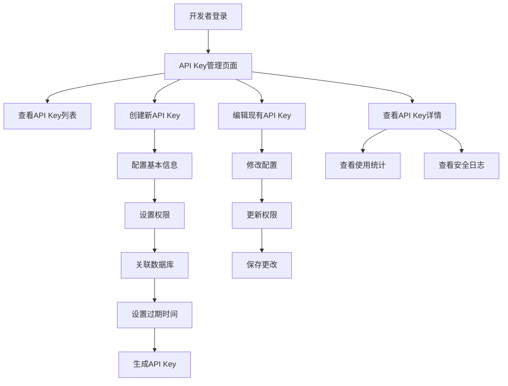

# 🔑 API Key管理功能 - 产品需求文档

## 1. 产品概述

API Key管理功能是AI语义化数据库管理系统的核心安全模块，为开发者角色提供API密钥的全生命周期管理能力。该功能支持细粒度权限控制、数据库关联配置和灵活的过期时间设置，确保系统API访问的安全性和可控性。

本功能专为开发者角色设计，提供直观的Web界面进行API密钥的创建、编辑、查看和删除操作，同时支持使用统计和安全审计功能。

## 2. 核心功能

### 2.1 用户角色

| 角色 | 访问权限 | 核心功能 |
|------|----------|----------|
| 开发者 (Developer) | API Key管理权限 | 创建、查看、编辑、删除自己的API Key |
| 管理员 (Admin) | 全局API Key管理权限 | 查看所有用户的API Key，执行管理操作 |

### 2.2 功能模块

本API Key管理功能包含以下核心页面：

1. **API Key列表页面**: 展示API Key列表，支持搜索筛选和批量操作
2. **API Key创建页面**: 创建新的API Key，配置权限和关联数据库
3. **API Key详情页面**: 查看API Key详细信息和使用统计
4. **API Key编辑页面**: 修改API Key配置和权限设置

### 2.3 页面详情

| 页面名称 | 模块名称 | 功能描述 |
|----------|----------|----------|
| API Key列表页面 | 列表展示模块 | 展示API Key列表，包含名称、权限、状态、创建时间、最后使用时间、到期时间等信息 |
| API Key列表页面 | 搜索筛选模块 | 支持按名称、状态、权限类型、到期时间进行搜索和筛选 |
| API Key列表页面 | 批量操作模块 | 支持批量启用、禁用、删除API Key操作 |
| API Key创建页面 | 基本信息配置 | 设置API Key名称、描述信息 |
| API Key创建页面 | 权限配置模块 | 配置增删改查权限，支持细粒度权限控制 |
| API Key创建页面 | 数据库关联模块 | 选择关联的数据库连接ID数组，支持多数据库访问 |
| API Key创建页面 | 过期时间设置 | 设置API Key过期时间，支持永久有效选项 |
| API Key详情页面 | 基本信息展示 | 显示API Key的所有配置信息和当前状态 |
| API Key详情页面 | 使用统计模块 | 展示API Key的调用次数、最后使用时间、使用趋势图表 |
| API Key详情页面 | 安全日志模块 | 显示API Key的使用日志和安全事件记录 |
| API Key编辑页面 | 配置修改模块 | 修改API Key的权限设置、关联数据库和过期时间 |
| API Key编辑页面 | 状态管理模块 | 启用、禁用、重新生成API Key |

## 3. 核心流程

### 开发者操作流程

开发者登录系统后，可以通过以下流程管理API Key：

1. **访问API Key管理页面** → 查看现有API Key列表
2. **创建新API Key** → 配置权限和数据库关联 → 生成密钥
3. **查看API Key详情** → 获取使用统计和安全信息
4. **编辑API Key配置** → 修改权限或关联数据库
5. **管理API Key状态** → 启用、禁用或删除密钥

### 管理员操作流程

管理员除了拥有开发者的所有权限外，还可以：

1. **查看全局API Key** → 监控所有用户的API Key使用情况
2. **执行安全审计** → 检查异常使用模式和安全风险
3. **批量管理操作** → 对多个API Key执行批量操作



## 4. 用户界面设计

### 4.1 设计风格

遵循系统UI设计标准，采用以下设计元素：

- **主色调**: 绿色系 (#10b981) 作为主要操作按钮和重要状态指示
- **辅助色**: 白色背景 (#ffffff)、深灰文本 (#1f2937)、浅灰边框 (#e2e8f0)
- **按钮风格**: 圆角设计，带有边框和阴影效果，悬停时有过渡动画
- **字体**: 系统默认字体，标题使用粗体，正文使用常规字重
- **布局风格**: 卡片式布局，清晰的层次结构，响应式设计
- **图标风格**: 使用Lucide图标库，线性风格，与界面整体风格保持一致

### 4.2 页面设计概览

| 页面名称 | 模块名称 | UI元素 |
|----------|----------|--------|
| API Key列表页面 | 页面头部 | 绿色渐变背景卡片，包含页面标题、描述和"创建API Key"按钮，使用绿色主色调 |
| API Key列表页面 | 搜索筛选区域 | 白色卡片容器，包含搜索输入框、状态筛选下拉框、权限类型筛选，绿色边框聚焦效果 |
| API Key列表页面 | 数据表格 | 斑马纹表格，绿色表头，悬停行高亮，状态标签使用对应颜色（绿色=活跃，红色=过期，灰色=禁用） |
| API Key列表页面 | 操作按钮 | 小尺寸轮廓按钮，编辑（绿色）、禁用（橙色）、删除（红色），带边框和悬停效果 |
| API Key创建页面 | 表单容器 | 白色卡片布局，分步骤表单设计，每个步骤使用独立的卡片区域 |
| API Key创建页面 | 权限配置 | 复选框组，绿色选中状态，清晰的权限说明文本 |
| API Key创建页面 | 数据库选择 | 多选下拉框，支持搜索，选中项使用绿色标签显示 |
| API Key详情页面 | 信息展示卡片 | 网格布局的信息卡片，重要信息使用绿色强调，统计数据使用图表可视化 |
| API Key编辑页面 | 编辑表单 | 与创建页面相似的表单设计，预填充现有数据，保存按钮使用绿色主色调 |

### 4.3 响应式设计

- **桌面端优先**: 主要针对开发者的桌面工作环境设计
- **移动端适配**: 表格在移动端转换为卡片布局，保持功能完整性
- **触摸优化**: 按钮和交互元素满足最小44px的触摸目标要求

## 5. 数据模型设计

### 5.1 API Key数据结构

```typescript
interface ApiKey {
  id: string;                    // API Key唯一标识
  userId: string;                // 所属用户ID
  name: string;                  // API Key名称
  apiKey: string;                // API Key (ak-开头的字符串)
  permissions: Permission[];     // 权限数组
  databaseIds: string[];         // 关联数据库ID数组
  expiresAt?: Date;             // 过期时间（可选，null表示永久）
  isActive: boolean;            // 是否启用
  lastUsedAt?: Date;            // 最后使用时间
  usageCount: number;           // 使用次数
  createdAt: Date;              // 创建时间
  updatedAt: Date;              // 更新时间
}

// 权限枚举
type Permission = 'read' | 'write' | 'delete' | 'admin';

// 创建API Key请求
interface CreateApiKeyRequest {
  name: string;
  permissions: Permission[];
  databaseIds: string[];
  expiresAt?: Date;
  description?: string;
}

// API Key使用统计
interface ApiKeyStats {
  totalCalls: number;
  dailyCalls: number;
  weeklyCalls: number;
  monthlyCalls: number;
  lastCallTime?: Date;
  errorRate: number;
}
```

### 5.2 数据库表设计

```sql
-- API Keys表
CREATE TABLE api_keys (
  id UUID PRIMARY KEY DEFAULT gen_random_uuid(),
  user_id UUID NOT NULL REFERENCES users(id) ON DELETE CASCADE,
  name VARCHAR(100) NOT NULL,
  api_key VARCHAR(64) UNIQUE NOT NULL, -- ak-开头的字符串
  permissions TEXT[] NOT NULL DEFAULT '{}',
  database_ids UUID[] NOT NULL DEFAULT '{}',
  expires_at TIMESTAMP WITH TIME ZONE,
  is_active BOOLEAN NOT NULL DEFAULT true,
  last_used_at TIMESTAMP WITH TIME ZONE,
  usage_count INTEGER NOT NULL DEFAULT 0,
  created_at TIMESTAMP WITH TIME ZONE DEFAULT NOW(),
  updated_at TIMESTAMP WITH TIME ZONE DEFAULT NOW()
);

-- 索引
CREATE INDEX idx_api_keys_user_id ON api_keys(user_id);
CREATE INDEX idx_api_keys_api_key ON api_keys(api_key);
CREATE INDEX idx_api_keys_expires_at ON api_keys(expires_at);
CREATE INDEX idx_api_keys_is_active ON api_keys(is_active);

-- API Key使用日志表
CREATE TABLE api_key_usage_logs (
  id UUID PRIMARY KEY DEFAULT gen_random_uuid(),
  api_key_id UUID NOT NULL REFERENCES api_keys(id) ON DELETE CASCADE,
  endpoint VARCHAR(255) NOT NULL,
  method VARCHAR(10) NOT NULL,
  ip_address INET,
  user_agent TEXT,
  response_status INTEGER,
  response_time INTEGER,
  created_at TIMESTAMP WITH TIME ZONE DEFAULT NOW()
);

-- 使用日志索引
CREATE INDEX idx_api_key_usage_logs_api_key_id ON api_key_usage_logs(api_key_id);
CREATE INDEX idx_api_key_usage_logs_created_at ON api_key_usage_logs(created_at DESC);
```

## 6. API接口设计

### 6.1 RESTful API端点

```typescript
// 获取API Key列表
GET /api/v1/api-keys
Query Parameters:
- page: number (页码)
- limit: number (每页数量)
- search: string (搜索关键词)
- status: 'active' | 'inactive' | 'expired' (状态筛选)
- permission: Permission (权限筛选)

// 创建API Key
POST /api/v1/api-keys
Body: CreateApiKeyRequest

// 获取API Key详情
GET /api/v1/api-keys/:id

// 更新API Key
PUT /api/v1/api-keys/:id
Body: Partial<CreateApiKeyRequest>

// 删除API Key
DELETE /api/v1/api-keys/:id

// 启用/禁用API Key
PATCH /api/v1/api-keys/:id/status
Body: { isActive: boolean }

// 重新生成API Key
POST /api/v1/api-keys/:id/regenerate

// 获取API Key使用统计
GET /api/v1/api-keys/:id/stats

// 获取API Key使用日志
GET /api/v1/api-keys/:id/logs
Query Parameters:
- page: number
- limit: number
- startDate: string (ISO日期)
- endDate: string (ISO日期)
```

### 6.2 响应格式示例

```json
// 成功响应 - API Key列表
{
  "data": [
    {
      "id": "550e8400-e29b-41d4-a716-446655440000",
      "name": "生产环境API Key",
      "apiKey": "ak-1234567890abcdef1234567890abcdef",
      "permissions": ["read", "write"],
      "databaseIds": ["db_001", "db_002"],
      "isActive": true,
      "expiresAt": "2024-12-31T23:59:59Z",
      "lastUsedAt": "2024-01-15T10:30:00Z",
      "usageCount": 1250,
      "createdAt": "2024-01-01T00:00:00Z"
    }
  ],
  "pagination": {
    "page": 1,
    "limit": 10,
    "total": 25,
    "totalPages": 3
  }
}

// 成功响应 - 创建API Key
{
  "id": "550e8400-e29b-41d4-a716-446655440000",
  "name": "新API Key",
  "apiKey": "ak-1234567890abcdef1234567890abcdef", // 仅在创建时返回
  "permissions": ["read"],
  "databaseIds": ["db_001"],
  "isActive": true,
  "expiresAt": null,
  "createdAt": "2024-01-15T10:30:00Z"
}

// 错误响应
{
  "message": "API Key名称已存在",
  "timestamp": "2024-01-15T10:30:00Z",
  "path": "/api/v1/api-keys"
}
```

## 7. 安全考虑

### 7.1 密钥安全
- API Key密钥使用bcrypt进行哈希存储，不存储明文
- 密钥生成使用加密安全的随机数生成器
- 支持密钥轮换，旧密钥有过渡期

### 7.2 权限控制
- 基于角色的访问控制（RBAC）
- 细粒度权限设置，最小权限原则
- API Key权限不能超过用户自身权限

### 7.3 审计日志
- 记录所有API Key操作日志
- 记录API Key使用情况和异常访问
- 支持安全事件告警

## 8. 技术实现要点

### 8.1 前端技术栈
- **框架**: Vue 3 + Composition API
- **样式**: TailwindCSS 4 + DaisyUI 5
- **状态管理**: Pinia
- **HTTP客户端**: Axios
- **图表**: ECharts (用于使用统计)

### 8.2 后端技术栈
- **框架**: Express.js + TypeScript
- **数据库**: PostgreSQL
- **认证**: JWT + bcrypt
- **日志**: Winston

### 8.3 关键实现细节
- API Key格式: `ak_` + 16位随机字符串（公开部分）
- 密钥格式: `sk_` + 32位随机字符串（私密部分）
- 权限验证中间件集成
- 自动过期清理任务
- 使用统计实时更新

---

*本文档将根据开发进度和用户反馈持续更新完善。*