# AI语义化数据库管理系统

一个由大模型驱动的智能化数据库管理系统，专注于PostgreSQL和MongoDB，支持多连接管理，通过AI语义理解实现自然语言到数据库操作的智能转换，提供全文搜索、向量搜索、连表查询和数据统计等高级功能。

## 🆕 最新更新

### v1.1.0 - API响应标准化 🎆

我们刚刚完成了一次重大的API响应格式标准化改造，提升了系统的简洁性和性能：

**主要改进**:
- ✨ **简化响应格式**: 移除了冗余的`success`字段和外层`data`包装
- ⚡ **直接数据返回**: 成功响应直接返回数据对象/数组
- 🛡️ **标准化错误处理**: 统一的错误响应格式 `{message, timestamp, path}`
- 🚀 **性能优化**: 响应体积减少，处理速度提升
- 👨‍💻 **开发体验提升**: 代码更简洁，类型安全性更强

**响应格式示例**:
```json
// 成功响应（有数据）
{
  "id": "user123",
  "username": "admin",
  "email": "admin@example.com"
}

// 成功响应（操作确认）
{"message": "操作成功"}

// 错误响应
{
  "message": "用户名和密码不能为空",
  "timestamp": "2025-08-24T06:41:29.056Z",
  "path": "/api/v1/users/auth/login"
}
```

> ⚠️ **破坏性更新**: 此版本与旧版本不兼容，客户端需要同时更新。

## 🚀 项目概述

本项目旨在构建一个智能化的数据库管理平台，用户可以通过自然语言描述需求，AI自动生成相应的SQL语句并执行数据库操作。系统采用前后端分离架构，支持多种类型的数据库连接和管理。

### ✨ 核心特性

- **🧠 AI语义化操作**: 深度理解自然语言意图，智能生成PostgreSQL/MongoDB查询语句
- **🔗 多连接管理**: 统一管理多个PostgreSQL和MongoDB连接，支持连接池和负载均衡
- **🔍 全文/向量搜索**: 支持传统全文搜索和基于pgvector/Atlas Vector Search的语义搜索
- **🤝 智能连表查询**: AI自动推断表关系，生成复杂的JOIN查询和聚合操作
- **📊 数据统计分析**: 智能数据分布分析、异常检测和趋势预测
- **🛠️ AI增强表管理**: 智能表结构设计、索引建议和性能优化
- **📈 实时监控**: 连接状态、查询性能和系统健康度实时监控
- **🔒 企业级安全**: JWT认证、权限控制、操作审计和数据加密
- **📱 现代化界面**: 基于Vue3的响应式多标签工作台，支持向量可视化
- **⚡ 高性能API**: 标准化RESTful API，连接复用和查询缓存优化

### 🏗️ AI语义化多连接管理架构

```
┌─────────────────────────────┐    ┌─────────────────────────────┐    ┌─────────────────────────────┐
│        前端界面层           │    │       AI语义处理层          │    │      多连接管理层           │
│                             │    │                             │    │                             │
│ • 多标签查询工作台          │◄──►│ • 自然语言理解 (NLU)        │◄──►│ • 连接池管理器              │
│ • AI语义搜索面板            │    │ • 意图识别引擎              │    │ • 适配器工厂                │
│ • 数据统计仪表板            │    │ • SQL/MongoDB查询生成       │    │ • 负载均衡器                │
│ • 向量可视化组件            │    │ • 向量嵌入服务              │    │ • 会话管理器                │
│ • 连接状态监控              │    │ • 智能分析引擎              │    │ • 健康检查器                │
└─────────────────────────────┘    └─────────────────────────────┘    └─────────────────────────────┘
                                                 │                                   │
                                                 ▼                                   ▼
┌─────────────────────────────┐    ┌─────────────────────────────┐    ┌─────────────────────────────┐
│       AI增强功能模块        │    │        数据库适配层         │    │       多数据库实例          │
│                             │    │                             │    │                             │
│ • 全文搜索引擎              │◄──►│ • PostgreSQL适配器池        │◄──►│ • PostgreSQL实例1,2,3...    │
│ • 向量搜索引擎              │    │ • MongoDB适配器池           │    │ • MongoDB实例1,2,3...       │
│ • 智能连表分析              │    │ • 查询优化器                │    │ • pgvector扩展支持          │
│ • 数据统计分析              │    │ • 结果缓存层                │    │ • Atlas Vector Search       │
│ • 查询性能优化              │    │ • 错误处理器                │    │ • 全文搜索索引              │
└─────────────────────────────┘    └─────────────────────────────┘    └─────────────────────────────┘
```

## 🛠️ 技术栈

### 前端技术
- **框架**: Vue 3 (Composition API)
- **构建工具**: Vite
- **样式**: TailwindCSS v4
- **状态管理**: Pinia
- **路由**: Vue Router
- **HTTP客户端**: Axios
- **组件库**: Element Plus

### 后端技术
- **运行时**: Node.js 22+
- **框架**: Express.js 5 (beta)
- **语言**: TypeScript（全项目类型安全）
- **数据库驱动**: pg (PostgreSQL), mongodb (MongoDB)
- **连接管理**: 自定义连接池管理器，多实例负载均衡
- **认证**: JWT + 权限控制
- **缓存**: Redis（查询结果缓存，会话管理）
- **监控**: 自定义性能监控，连接状态追踪
- **日志**: Winston（结构化日志，按连接分类）

### AI语义化技术
- **大模型**: OpenAI GPT-4, Claude-3, 本地LLM支持
- **自然语言理解**: 深度意图识别和上下文分析
- **查询生成**: SQL/MongoDB查询智能生成和优化
- **向量处理**: OpenAI Embeddings, 本地嵌入模型
- **语义搜索**: pgvector, MongoDB Atlas Vector Search
- **智能分析**: 数据统计、异常检测、趋势预测

## 📋 实施进度

### ✅ Phase 0: API响应标准化 (Week 0) - 已完成
- [x] API响应格式标准化设计
- [x] 后端路由层改造（auth, users, apiKeys）
- [x] 后端错误处理中间件标准化
- [x] 前端API工具类和Store层适配
- [x] TypeScript类型定义重构
- [x] 全面测试验证和文档更新

### Phase 1: 基础架构搭建 (Week 1-2)
- [x] 项目初始化和目录结构
- [x] 后端Express框架搭建
- [x] 前端Vue3项目初始化
- [x] SQLite数据库设计
- [x] 基础API接口设计

### Phase 2: 核心功能开发 (Week 3-4)
- [ ] 数据库连接管理
- [ ] 统一数据库适配器实现
- [ ] AI服务集成
- [ ] 自然语言查询处理
- [ ] 基础前端界面开发

### Phase 3: 高级功能实现 (Week 5-6)
- [ ] 智能表管理功能
- [ ] 数据可视化组件
- [ ] JSON Schema生成
- [ ] 查询优化建议
- [ ] 用户权限管理

### Phase 4: 优化与部署 (Week 7-8)
- [ ] 性能优化
- [ ] 安全加固
- [ ] 单元测试和集成测试
- [ ] 部署配置
- [ ] 文档完善

## 🚀 快速开始

> ⚠️ **重要提示**: 如果您之前使用过本项目，请注意我们在v1.1.0中对API响应格式进行了标准化改造。这是一个**破坏性更新**，客户端代码需要相应调整。
> 
> 📚 **迁移指南**: [API_MIGRATION_GUIDE.md](API_MIGRATION_GUIDE.md)  
> 📊 **完整报告**: [API_STANDARDIZATION_REPORT.md](API_STANDARDIZATION_REPORT.md)

### 使用脚本（推荐）

我们提供了完整的脚本工具套件，支持一键式开发环境管理：

```bash
# 启动交互式主菜单
./run.sh

# 或者直接使用具体脚本
./scripts/dev.sh install    # 初始化项目
./scripts/dev.sh start      # 启动开发服务器
./scripts/health-check.sh   # 检查系统状态
```

**Windows用户**：
```cmd
scripts\dev.bat install
scripts\dev.bat start
```

### 手动安装

如果您喜欢手动操作：

### 环境要求
- Node.js >= 22.0.0
- npm >= 10.0.0

### 安装运行

1. **克隆项目**
```bash
git clone https://github.com/niklaslc/ai-database.git
cd ai-database
```

2. **安装依赖**
```bash
# 安装后端依赖
cd backend
npm install

# 安装前端依赖
cd ../frontend
npm install
```

3. **配置环境变量**
```bash
# 后端环境配置
cp backend/.env.example backend/.env
# 配置数据库连接和AI API密钥

# 前端环境配置
cp frontend/.env.example frontend/.env
```

4. **启动服务**
```bash
# 启动后端服务
cd backend
npm run dev

# 启动前端服务
cd ../frontend
npm run dev
```

访问 `http://localhost:3000` 即可使用系统。

### 🛠️ 开发工具

我们提供了完整的开发工具链：

- **交互式主菜单**: `./run.sh` - 一键启动所有功能
- **开发脚本**: `scripts/dev.sh` - 项目初始化和服务管理
- **健康检查**: `scripts/health-check.sh` - 系统状态监控
- **部署检查**: `scripts/production-check.sh` - 生产环境验证

详细使用说明请查看：[scripts/README.md](scripts/README.md)

## 📚 API使用示例

### ✅ 成功响应示例

**用户登录**（数据响应）：
```bash
curl -X POST http://localhost:3000/api/v1/users/auth/login \
  -H "Content-Type: application/json" \
  -d '{"username":"admin","password":"admin123456"}'
```

```json
{
  "user": {
    "id": "1",
    "username": "admin",
    "email": "admin@example.com",
    "role": "admin"
  },
  "token": "eyJhbGciOiJIUzI1NiIs...",
  "expiresAt": "2025-08-25T06:41:10.724Z"
}
```

**密码修改**（操作确认）：
```bash
curl -X PUT http://localhost:3000/api/v1/users/me/password \
  -H "Authorization: Bearer YOUR_TOKEN" \
  -H "Content-Type: application/json" \
  -d '{"oldPassword":"old123","newPassword":"new123"}'
```

```json
{"message": "密码修改成功"}
```

### ❌ 错误响应示例

**登录失败**：
```bash
curl -X POST http://localhost:3000/api/v1/users/auth/login \
  -H "Content-Type: application/json" \
  -d '{"username":"admin","password":"wrongpassword"}'
```

```json
{
  "message": "用户名或密码错误",
  "timestamp": "2025-08-24T06:40:19.757Z",
  "path": "/api/v1/users/auth/login"
}
```

> 💡 **新API格式特点**：
> - ✅ 成功响应直接返回数据，无冗余字段
> - ⚡ 响应体积更小，传输更高效  
> - 🛡️ 错误信息标准化，包含时间戳和路径
> - 🔢 使用HTTP状态码表示成功/失败状态

## 🧠 AI语义化操作流程

> 📚 **详细流程设计**: [AI_SEMANTIC_WORKFLOW.md](AI_SEMANTIC_WORKFLOW.md)

### 核心处理流程

```mermaid
graph LR
    A["🗣️ 自然语言输入"] --> B["🧠 意图识别"]
    B --> C["📋 库表结构分析"]
    C --> D["🔨 SQL构建"]
    D --> E["✅ 安全检查"]
    E --> F["⚡ 执行查询"]
    F --> G["📊 结果处理"]
    G --> H["📤 返回结果"]
```



### 智能查询示例

```javascript
// 用户输入
"查询销售额最高的前10个产品及其分类信息"

// AI处理流程
1. 意图识别: SELECT查询，涉及产品和销售数据
2. 实体抽取: products表、orders表、categories表
3. 关系分析: 自动推断JOIN关系
4. SQL生成: 
   SELECT p.name, c.name as category, SUM(o.amount) as total_sales
   FROM products p 
   JOIN categories c ON p.category_id = c.id
   JOIN orders o ON p.id = o.product_id 
   GROUP BY p.id, p.name, c.name 
   ORDER BY total_sales DESC 
   LIMIT 10
5. 结果: 智能格式化的数据表格 + 可视化图表
```

### 表管理示例

```
用户输入: "创建一个用户表，包含姓名、邮箱、密码和创建时间"

AI处理流程:
1. 解析需求: 创建用户表
2. 字段分析: name, email, password, created_at
3. SQL生成:
   CREATE TABLE users (
     id INT PRIMARY KEY AUTO_INCREMENT,
     name VARCHAR(100) NOT NULL,
     email VARCHAR(255) UNIQUE NOT NULL,
     password VARCHAR(255) NOT NULL,
     created_at TIMESTAMP DEFAULT CURRENT_TIMESTAMP
   )
```

## 🔧 配置说明

### 数据库连接配置

支持多种数据库类型的连接：

```typescript
{
  "name": "MySQL生产环境",
  "type": "mysql",
  "host": "localhost",
  "port": 3306,
  "database": "production_db",
  "username": "admin",
  "password": "***",
  "ssl": true
}
```

### AI模型配置

```typescript
{
  "provider": "openai", // openai, claude, custom
  "apiKey": "sk-***",
  "model": "gpt-4",
  "maxTokens": 2048,
  "temperature": 0.1
}
```

## 🤝 贡献指南

欢迎提交Issue和Pull Request！

1. Fork本项目
2. 创建功能分支 (`git checkout -b feature/AmazingFeature`)
3. 提交更改 (`git commit -m 'Add some AmazingFeature'`)
4. 推送到分支 (`git push origin feature/AmazingFeature`)
5. 创建Pull Request

## 📄 许可证

本项目使用 MIT 许可证。详情请见 [LICENSE](LICENSE) 文件。

## 🔮 未来规划

### 短期目标 (1-3个月)
- 支持更多数据库类型 (Oracle, SQL Server)
- 增强AI查询准确性
- 添加数据导入导出功能
- 实现查询结果缓存

### 中期目标 (3-6个月)
- 支持分布式数据库
- 添加实时数据监控
- 实现协作功能
- 移动端适配

### 长期目标 (6-12个月)
- 支持数据仓库和大数据平台
- AI驱动的数据库优化建议
- 企业级权限管理
- 云原生部署方案

## 📞 联系我们

- 项目维护者: [Your Name]
- 邮箱: your.email@example.com
- GitHub: [@niklaslc](https://github.com/niklaslc)

---

⭐ 如果这个项目对您有帮助，请给我们一个Star！