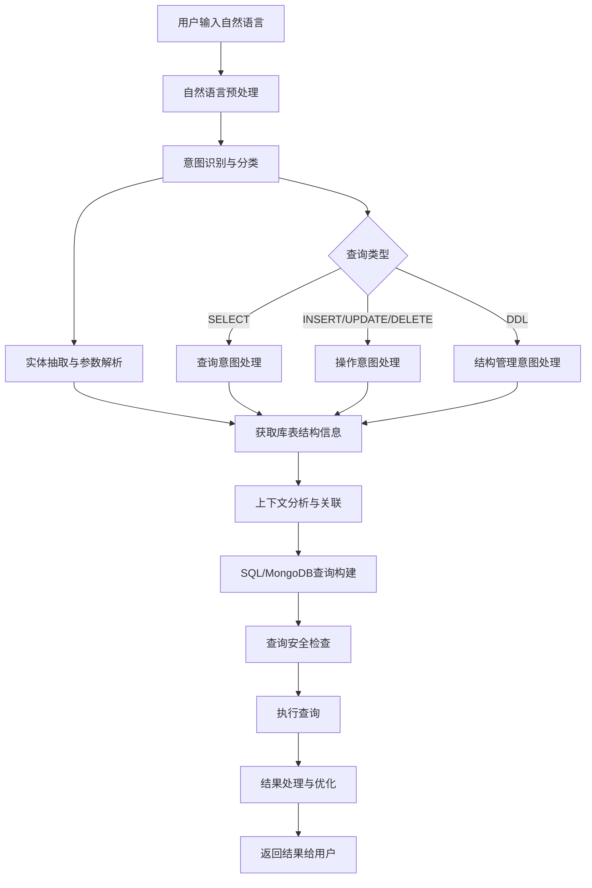

# AI语义化数据库操作流程设计

## 1. 流程概述

AI语义化数据库操作通过自然语言理解、意图识别、库表结构分析、SQL构建和执行等步骤，实现从用户自然语言到数据库操作的智能转换。

## 2. 核心流程架构



## 3. 详细实现流程

### 3.1 自然语言预处理
- **文本清理**: 去除特殊字符，标准化格式
- **分词处理**: 中英文分词，识别关键词
- **语法分析**: 句法结构分析，提取主谓宾关系

### 3.2 意图识别与分类
```typescript
interface QueryIntent {
  type: 'SELECT' | 'INSERT' | 'UPDATE' | 'DELETE' | 'CREATE' | 'ALTER' | 'DROP';
  confidence: number;
  entities: EntityInfo[];
  conditions: ConditionInfo[];
  operations: OperationInfo[];
}

class IntentClassifier {
  async classify(input: string): Promise<QueryIntent> {
    // 使用大模型进行意图分类
    const prompt = `
    分析以下用户查询的意图类型和关键信息：
    用户输入: "${input}"
    
    请返回JSON格式：
    {
      "type": "查询类型",
      "entities": ["涉及的实体"],
      "conditions": ["查询条件"],
      "operations": ["操作类型"]
    }
    `;
    
    return await this.aiService.analyze(prompt);
  }
}
```

### 3.3 库表结构分析
```typescript
class SchemaAnalyzer {
  async analyzeSchema(connectionId: string): Promise<DatabaseSchema> {
    const adapter = await AdapterFactory.getAdapter(connectionId);
    const tables = await adapter.getTables();
    
    const schema: DatabaseSchema = {
      tables: [],
      relationships: []
    };
    
    for (const table of tables) {
      const columns = await adapter.getTableSchema(table.name);
      const indexes = await adapter.getIndexes(table.name);
      
      schema.tables.push({
        name: table.name,
        columns,
        indexes,
        type: table.type
      });
    }
    
    // 分析表关系
    schema.relationships = await this.inferTableRelationships(schema.tables);
    
    return schema;
  }
}
```

### 3.4 SQL构建引擎
```typescript
class SQLBuilder {
  async buildQuery(
    intent: QueryIntent, 
    schema: DatabaseSchema, 
    dbType: 'postgresql' | 'mongodb'
  ): Promise<GeneratedQuery> {
    
    const context = {
      availableTables: schema.tables,
      relationships: schema.relationships,
      userIntent: intent
    };
    
    if (dbType === 'postgresql') {
      return this.buildSQLQuery(context);
    } else {
      return this.buildMongoQuery(context);
    }
  }
  
  private async buildSQLQuery(context: QueryContext): Promise<GeneratedQuery> {
    const prompt = `
    根据以下信息生成PostgreSQL查询：
    
    用户意图: ${JSON.stringify(context.userIntent)}
    可用表结构: ${JSON.stringify(context.availableTables)}
    表关系: ${JSON.stringify(context.relationships)}
    
    要求：
    1. 生成语法正确的SQL
    2. 使用适当的JOIN
    3. 添加必要的WHERE条件
    4. 考虑性能优化
    `;
    
    const response = await this.aiService.generateSQL(prompt);
    
    return {
      sql: response.sql,
      explanation: response.explanation,
      confidence: response.confidence,
      performance: response.performance
    };
  }
}
```

## 4. 核心组件实现

### 4.1 语义化查询服务
```typescript
export class SemanticQueryService {
  constructor(
    private aiService: AIService,
    private schemaAnalyzer: SchemaAnalyzer,
    private sqlBuilder: SQLBuilder,
    private queryExecutor: QueryExecutor
  ) {}
  
  async processNaturalQuery(
    naturalLanguage: string,
    connectionId: string
  ): Promise<SemanticQueryResult> {
    
    // 1. 意图识别
    const intent = await this.classifyIntent(naturalLanguage);
    
    // 2. 获取库表结构
    const schema = await this.schemaAnalyzer.analyzeSchema(connectionId);
    
    // 3. 构建查询
    const connection = await this.getConnection(connectionId);
    const query = await this.sqlBuilder.buildQuery(intent, schema, connection.type);
    
    // 4. 安全检查
    await this.validateQuery(query, intent);
    
    // 5. 执行查询
    const result = await this.queryExecutor.execute(connectionId, query);
    
    // 6. 结果处理
    const processedResult = await this.processResult(result, intent);
    
    return {
      originalQuery: naturalLanguage,
      intent,
      generatedQuery: query,
      result: processedResult,
      executionTime: result.executionTime,
      explanation: this.generateExplanation(intent, query, result)
    };
  }
}
```

### 4.2 查询执行器
```typescript
export class QueryExecutor {
  async execute(connectionId: string, query: GeneratedQuery): Promise<QueryResult> {
    const adapter = await AdapterFactory.getAdapter(connectionId);
    
    try {
      // 记录查询开始
      AdapterFactory.recordQuery(connectionId, adapter.type);
      
      // 执行查询
      const result = await adapter.executeQuery(query.sql, query.params);
      
      // 记录成功
      this.logQuerySuccess(connectionId, query, result);
      
      return result;
      
    } catch (error) {
      // 记录错误
      AdapterFactory.recordError(connectionId, adapter.type);
      this.logQueryError(connectionId, query, error);
      throw error;
    }
  }
}
```

## 5. 使用示例

### 5.1 查询示例
```javascript
// 用户输入
const userInput = "查询销售额最高的前10个产品";

// 系统处理流程
const result = await semanticQueryService.processNaturalQuery(userInput, connectionId);

// 返回结果
{
  "originalQuery": "查询销售额最高的前10个产品",
  "intent": {
    "type": "SELECT",
    "entities": ["products", "sales"],
    "conditions": ["ORDER BY sales DESC", "LIMIT 10"]
  },
  "generatedQuery": {
    "sql": "SELECT p.*, SUM(o.amount) as total_sales FROM products p JOIN orders o ON p.id = o.product_id GROUP BY p.id ORDER BY total_sales DESC LIMIT 10",
    "explanation": "查询产品销售额，按销售额降序排列，取前10条"
  },
  "result": {
    "rows": [...],
    "rowCount": 10,
    "executionTime": 156
  }
}
```

### 5.2 表管理示例
```javascript
// 用户输入
const userInput = "创建一个订单表，包含订单号、用户ID、产品ID、数量、金额和创建时间";

// 系统处理
const result = await semanticQueryService.processNaturalQuery(userInput, connectionId);

// 生成DDL
{
  "generatedQuery": {
    "sql": "CREATE TABLE orders (id SERIAL PRIMARY KEY, order_no VARCHAR(50) UNIQUE NOT NULL, user_id INTEGER REFERENCES users(id), product_id INTEGER REFERENCES products(id), quantity INTEGER NOT NULL, amount DECIMAL(10,2) NOT NULL, created_at TIMESTAMP DEFAULT CURRENT_TIMESTAMP)",
    "explanation": "根据需求创建订单表，包含外键关联和适当的约束"
  }
}
```

## 6. 性能优化策略

### 6.1 查询缓存
- **结构化缓存**: 缓存库表结构信息
- **查询结果缓存**: 缓存常用查询结果
- **AI响应缓存**: 缓存相似查询的AI分析结果

### 6.2 智能路由
- **负载均衡**: 根据连接负载智能分配查询
- **读写分离**: 区分读写操作，分配到不同实例
- **性能监控**: 实时监控查询性能，动态调整路由策略

## 7. 扩展功能

### 7.1 向量搜索集成
```typescript
// PostgreSQL向量搜索
const vectorQuery = `
  SELECT *, embedding <-> $1 as distance 
  FROM documents 
  ORDER BY embedding <-> $1 
  LIMIT 10
`;

// MongoDB向量搜索
const mongoVectorPipeline = [
  {
    $vectorSearch: {
      index: "vector_index",
      path: "embedding", 
      queryVector: userVector,
      numCandidates: 100,
      limit: 10
    }
  }
];
```

### 7.2 多表智能关联
```typescript
class IntelligentJoinAnalyzer {
  async suggestJoins(tables: string[], schema: DatabaseSchema): Promise<JoinSuggestion[]> {
    // 基于外键关系自动推荐JOIN条件
    // 使用AI分析表名和字段名相似性
    // 生成最优的JOIN策略
  }
}
```

这个流程设计提供了完整的AI语义化数据库操作解决方案，支持从自然语言到数据库操作的智能转换，确保了查询的准确性、安全性和性能。