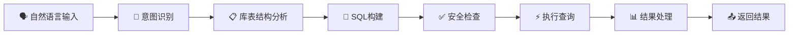

# AI语义化数据库管理系统 - 技术架构

## 🏗️ 系统架构

### 整体架构图

```
┌─────────────────────────────┐    ┌─────────────────────────────┐    ┌─────────────────────────────┐
│        前端界面层           │    │       AI语义处理层          │    │      多连接管理层           │
│                             │    │                             │    │                             │
│ • 多标签查询工作台          │◄──►│ • 自然语言理解 (NLU)        │◄──►│ • 连接池管理器              │
│ • AI语义搜索面板            │    │ • 意图识别引擎              │    │ • 适配器工厂                │
│ • 数据统计仪表板            │    │ • SQL/MongoDB查询生成       │    │ • 负载均衡器                │
│ • 向量可视化组件            │    │ • 向量嵌入服务              │    │ • 会话管理器                │
│ • 连接状态监控              │    │ • 智能分析引擎              │    │ • 健康检查器                │
└─────────────────────────────┘    └─────────────────────────────┘    └─────────────────────────────┘
                                                 │                                   │
                                                 ▼                                   ▼
┌─────────────────────────────┐    ┌─────────────────────────────┐    ┌─────────────────────────────┐
│       AI增强功能模块        │    │        数据库适配层         │    │       多数据库实例          │
│                             │    │                             │    │                             │
│ • 全文搜索引擎              │◄──►│ • PostgreSQL适配器池        │◄──►│ • PostgreSQL实例1,2,3...    │
│ • 向量搜索引擎              │    │ • MongoDB适配器池           │    │ • MongoDB实例1,2,3...       │
│ • 智能连表分析              │    │ • 查询优化器                │    │ • pgvector扩展支持          │
│ • 数据统计分析              │    │ • 结果缓存层                │    │ • Atlas Vector Search       │
│ • 查询性能优化              │    │ • 错误处理器                │    │ • 全文搜索索引              │
└─────────────────────────────┘    └─────────────────────────────┘    └─────────────────────────────┘
```

## 🧠 AI语义化处理流程

### 核心处理流程



### 智能查询示例

```javascript
// 用户输入
"查询销售额最高的前10个产品及其分类信息"

// AI处理流程
1. 意图识别: SELECT查询，涉及产品和销售数据
2. 实体抽取: products表、orders表、categories表
3. 关系分析: 自动推断JOIN关系
4. SQL生成: 
   SELECT p.name, c.name as category, SUM(o.amount) as total_sales
   FROM products p 
   JOIN categories c ON p.category_id = c.id
   JOIN orders o ON p.id = o.product_id 
   GROUP BY p.id, p.name, c.name 
   ORDER BY total_sales DESC 
   LIMIT 10
5. 结果: 智能格式化的数据表格 + 可视化图表
```

## 🛠️ 技术栈详情

### 前端技术
- **框架**: Vue 3 (Composition API)
- **构建工具**: Vite
- **样式**: TailwindCSS v4
- **状态管理**: Pinia
- **路由**: Vue Router
- **HTTP客户端**: Axios
- **组件库**: Element Plus

### 后端技术
- **运行时**: Node.js 22+
- **框架**: Express.js 5 (beta)
- **语言**: TypeScript（全项目类型安全）
- **数据库驱动**: pg (PostgreSQL), mongodb (MongoDB)
- **连接管理**: 自定义连接池管理器，多实例负载均衡
- **认证**: JWT + 权限控制
- **缓存**: Redis（查询结果缓存，会话管理）
- **监控**: 自定义性能监控，连接状态追踪
- **日志**: Winston（结构化日志，按连接分类）

### AI语义化技术
- **大模型**: OpenAI GPT-4, Claude-3, 本地LLM支持
- **自然语言理解**: 深度意图识别和上下文分析
- **查询生成**: SQL/MongoDB查询智能生成和优化
- **向量处理**: OpenAI Embeddings, 本地嵌入模型
- **语义搜索**: pgvector, MongoDB Atlas Vector Search
- **智能分析**: 数据统计、异常检测、趋势预测

## 🔧 配置说明

### 数据库连接配置

支持多种数据库类型的连接：

```typescript
{
  "name": "MySQL生产环境",
  "type": "mysql",
  "host": "localhost",
  "port": 3306,
  "database": "production_db",
  "username": "admin",
  "password": "***",
  "ssl": true
}
```

### AI模型配置

```typescript
{
  "provider": "openai", // openai, claude, custom
  "apiKey": "sk-***",
  "model": "gpt-4",
  "maxTokens": 2048,
  "temperature": 0.1
}
```

## 📊 性能优化

### 连接池管理
- 智能连接复用
- 负载均衡算法
- 连接健康检查
- 自动故障转移

### 查询优化
- SQL查询缓存
- 结果集缓存
- 索引建议
- 执行计划分析

### 前端优化
- 组件懒加载
- 虚拟滚动
- 数据分页
- 响应式缓存

## 🔒 安全机制

### 认证授权
- JWT Token认证
- 基于角色的权限控制
- API密钥管理
- 会话管理

### 数据安全
- SQL注入防护
- 参数化查询
- 敏感数据加密
- 操作审计日志

### 网络安全
- HTTPS强制
- CORS配置
- 请求频率限制
- 防火墙规则